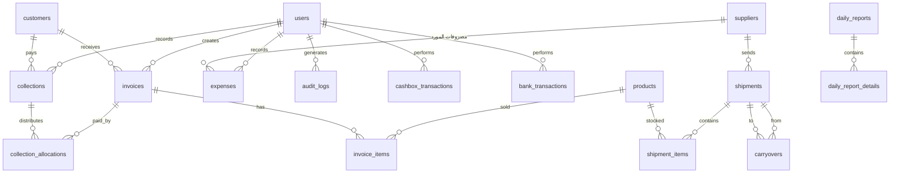

# Database Schema - نظام إدارة المبيعات والشحنات

Complete MySQL Database Schema for Inventory Management System

---

## Entity Relationship Diagram



---

## Tables Overview

| Table | Arabic Name | Purpose |
|-------|-------------|---------|
| `users` | المستخدمين | System users with permissions |
| `customers` | العملاء | Customer accounts & balances |
| `suppliers` | الموردين | Supplier accounts & balances |
| `products` | الأصناف | 9 fixed product types |
| `shipments` | الشحنات | Supplier shipments |
| `shipment_items` | أصناف الشحنة | Items per shipment with FIFO tracking |
| `carryovers` | الترحيلات | Transfers between shipments |
| `invoices` | الفواتير | Sales invoices |
| `invoice_items` | بنود الفاتورة | Invoice line items |
| `returns` | المرتجعات | Customer returns ← جديد |
| `return_items` | بنود المرتجع | Return line items ← جديد |
| `collections` | التحصيلات | Customer payments |
| `collection_allocations` | توزيع التحصيل | Payment distribution to invoices |
| `expenses` | المصروفات | Company & supplier expenses |
| `cashbox_transactions` | حركات الخزنة | Cash transactions |
| `bank_transactions` | حركات البنك | Bank transactions |
| `transfers` | التحويلات | Cashbox ↔ Bank transfers |
| `daily_reports` | التقارير اليومية | Daily closing reports |
| `settings` | الإعدادات | System settings |
| `audit_logs` | سجل العمليات | All operations log |
| `ai_alerts` | تنبيهات الذكاء | AI-generated alerts |

---

## 1. Users Table (المستخدمين)

```sql
CREATE TABLE users (
    id BIGINT UNSIGNED AUTO_INCREMENT PRIMARY KEY,
    name VARCHAR(255) NOT NULL,
    email VARCHAR(255) NOT NULL UNIQUE,
    password VARCHAR(255) NULL, -- للمستخدمين بدون Google OAuth
    google_id VARCHAR(255) NULL UNIQUE,
    avatar VARCHAR(255) NULL,
    
    -- Permissions (JSON array of permission codes)
    permissions JSON NOT NULL DEFAULT '[]',
    is_admin BOOLEAN DEFAULT FALSE,
    
    -- Security
    failed_login_attempts TINYINT UNSIGNED DEFAULT 0,
    is_locked BOOLEAN DEFAULT FALSE,
    locked_at TIMESTAMP NULL,
    locked_by BIGINT UNSIGNED NULL,
    remember_token VARCHAR(100) NULL,
    
    -- Timestamps
    email_verified_at TIMESTAMP NULL,
    created_at TIMESTAMP DEFAULT CURRENT_TIMESTAMP,
    updated_at TIMESTAMP DEFAULT CURRENT_TIMESTAMP ON UPDATE CURRENT_TIMESTAMP,
    
    FOREIGN KEY (locked_by) REFERENCES users(id) ON DELETE SET NULL
) ENGINE=InnoDB DEFAULT CHARSET=utf8mb4 COLLATE=utf8mb4_unicode_ci;
```

### Permissions List (48 Total) <!-- تصحيح 2025-12-13: +2 cancel permissions -->
```sql
-- Permission codes stored in JSON array
-- Example: ["invoices.create", "invoices.edit", "collections.create"]

-- Invoices (الفواتير)
'invoices.view', 'invoices.create', 'invoices.edit', 'invoices.delete', -- ⚠️ delete مُعطّل (Observer يمنع الحذف)
'invoices.cancel' -- ✅ جديد: بديل الحذف

-- Collections (التحصيل)
'collections.view', 'collections.create', 'collections.edit', 'collections.delete', -- ⚠️ delete مُعطّل (Observer يمنع الحذف)
'collections.cancel' -- ✅ جديد: بديل الحذف

-- Expenses (المصروفات)
'expenses.view', 'expenses.create', 'expenses.edit', 'expenses.delete'

-- Shipments (الشحنات)
'shipments.view', 'shipments.create', 'shipments.edit', 'shipments.delete', 'shipments.close'

-- Inventory (المخزون)
'inventory.view', 'inventory.adjust', 'inventory.wastage'

-- Cashbox (الخزنة)
'cashbox.view', 'cashbox.deposit', 'cashbox.withdraw', 'cashbox.transfer'

-- Bank (البنك)
'bank.view', 'bank.deposit', 'bank.withdraw', 'bank.transfer'

-- Customers (العملاء)
'customers.view', 'customers.create', 'customers.edit', 'customers.delete'

-- Reports (التقارير)
'reports.daily', 'reports.settlement', 'reports.customers', 'reports.suppliers',
'reports.inventory', 'reports.export_pdf', 'reports.export_excel', 'reports.share'

-- Daily Close (إغلاق اليوم)
'daily.close', 'daily.reopen'

-- Users (المستخدمين)
'users.view', 'users.create', 'users.edit', 'users.delete', 'users.unlock'

-- Settings (الإعدادات)
'settings.view', 'settings.edit'
```

---

## 2. Customers Table (العملاء)

> **Balance Logic (القاعدة الذهبية):**
> - `+` موجب = العميل **مديون** (عليه فلوس) - الوضع الطبيعي
> - `0` صفر = الحساب **خالص**
> - `-` سالب = العميل له **رصيد دائن** (دفع زيادة)

```sql
CREATE TABLE customers (
    id BIGINT UNSIGNED AUTO_INCREMENT PRIMARY KEY,
    code VARCHAR(50) NOT NULL UNIQUE,
    name VARCHAR(255) NOT NULL,
    phone VARCHAR(20) NULL,
    address TEXT NULL,
    
    -- Balance: (+) مديون | (0) خالص | (-) رصيد دائن
    balance DECIMAL(15,2) DEFAULT 0.00,
    
    -- Status
    is_active BOOLEAN DEFAULT TRUE,
    notes TEXT NULL,
    
    -- Timestamps
    created_at TIMESTAMP DEFAULT CURRENT_TIMESTAMP,
    updated_at TIMESTAMP DEFAULT CURRENT_TIMESTAMP ON UPDATE CURRENT_TIMESTAMP,
    
    INDEX idx_code (code),
    INDEX idx_name (name),
    INDEX idx_balance (balance)
) ENGINE=InnoDB DEFAULT CHARSET=utf8mb4 COLLATE=utf8mb4_unicode_ci;
```

---

## 3. Suppliers Table (الموردين)

> **Balance Logic:**
> - `+` موجب = المورد له فلوس عندنا (نحن مديونين له)
> - `0` صفر = الحساب خالص
> - `-` سالب = المورد مديون لنا (دفعنا له زيادة)

```sql
CREATE TABLE suppliers (
    id BIGINT UNSIGNED AUTO_INCREMENT PRIMARY KEY,
    code VARCHAR(50) NOT NULL UNIQUE,
    name VARCHAR(255) NOT NULL,
    phone VARCHAR(20) NULL,
    address TEXT NULL,
    
    -- Balance: (+) له عندنا | (0) خالص | (-) علينا
    balance DECIMAL(15,2) DEFAULT 0.00,
    
    -- Status
    is_active BOOLEAN DEFAULT TRUE,
    notes TEXT NULL,
    
    -- Timestamps
    created_at TIMESTAMP DEFAULT CURRENT_TIMESTAMP,
    updated_at TIMESTAMP DEFAULT CURRENT_TIMESTAMP ON UPDATE CURRENT_TIMESTAMP,
    
    INDEX idx_balance (balance)
) ENGINE=InnoDB DEFAULT CHARSET=utf8mb4 COLLATE=utf8mb4_unicode_ci;
```

---

## 4. Products Table (الأصناف)

> **⚠️ ملاحظة:** الـ Schema الفعلي المُطبق يستخدم `name` بدلاً من `code` + `name_ar`
> هذا هو الـ Schema المُنفذ في الـ Production migrations.

```sql
CREATE TABLE products (
    id BIGINT UNSIGNED AUTO_INCREMENT PRIMARY KEY,
    name VARCHAR(255) NOT NULL UNIQUE,
    name_en VARCHAR(255) NULL,
    category VARCHAR(100) NULL,
    description TEXT NULL,
    
    -- Status
    is_active BOOLEAN DEFAULT TRUE,
    
    -- Timestamps
    created_at TIMESTAMP DEFAULT CURRENT_TIMESTAMP,
    updated_at TIMESTAMP DEFAULT CURRENT_TIMESTAMP ON UPDATE CURRENT_TIMESTAMP
) ENGINE=InnoDB DEFAULT CHARSET=utf8mb4 COLLATE=utf8mb4_unicode_ci;

-- Seed products (example)
INSERT INTO products (name, name_en, category) VALUES
('الصنف الأول', 'Product 1', 'category_a'),
('الصنف الثاني', 'Product 2', 'category_b'),
('الصنف الثالث', 'Product 3', 'category_c');
```

---

## 5. Shipments Table (الشحنات)

```sql
CREATE TABLE shipments (
    id BIGINT UNSIGNED AUTO_INCREMENT PRIMARY KEY,
    number VARCHAR(50) NOT NULL UNIQUE,
    supplier_id BIGINT UNSIGNED NOT NULL,
    
    -- Shipment details
    date DATE NOT NULL,
    driver_name VARCHAR(255) NULL,
    vehicle_number VARCHAR(50) NULL,
    
    -- Status
    status ENUM('open', 'closed', 'settled') DEFAULT 'open',
    closed_at TIMESTAMP NULL,
    settled_at TIMESTAMP NULL,
    
    -- Settlement totals (calculated on close)
    total_sales DECIMAL(15,2) DEFAULT 0.00,
    total_returns DECIMAL(15,2) DEFAULT 0.00,
    total_wastage DECIMAL(15,2) DEFAULT 0.00,
    total_carryover_out DECIMAL(15,2) DEFAULT 0.00,
    total_supplier_expenses DECIMAL(15,2) DEFAULT 0.00,
    final_balance DECIMAL(15,2) DEFAULT 0.00,
    
    -- Metadata
    notes TEXT NULL,
    created_by BIGINT UNSIGNED NOT NULL,
    
    -- Timestamps
    created_at TIMESTAMP DEFAULT CURRENT_TIMESTAMP,
    updated_at TIMESTAMP DEFAULT CURRENT_TIMESTAMP ON UPDATE CURRENT_TIMESTAMP,
    
    FOREIGN KEY (supplier_id) REFERENCES suppliers(id),
    FOREIGN KEY (created_by) REFERENCES users(id),
    INDEX idx_number (number),
    INDEX idx_date (date),
    INDEX idx_status (status)
) ENGINE=InnoDB DEFAULT CHARSET=utf8mb4 COLLATE=utf8mb4_unicode_ci;
```

---

## 6. Shipment Items Table (أصناف الشحنة) - FIFO Core

```sql
CREATE TABLE shipment_items (
    id BIGINT UNSIGNED AUTO_INCREMENT PRIMARY KEY,
    shipment_id BIGINT UNSIGNED NOT NULL,
    product_id BIGINT UNSIGNED NOT NULL,
    
    -- Weight can vary per shipment (e.g., A10, A9)
    weight_label VARCHAR(50) NULL COMMENT 'مثال: A10, A9',
    weight_per_unit DECIMAL(10,3) NOT NULL COMMENT 'وزن الوحدة بالكيلو',
    
    -- Quantities
    cartons INT UNSIGNED NOT NULL COMMENT 'عدد الكراتين',
    initial_quantity DECIMAL(15,3) NOT NULL COMMENT 'الكمية الأصلية بالكيلو',
    remaining_quantity DECIMAL(15,3) NOT NULL COMMENT 'المتبقي للـ FIFO',
    
    -- Tracking
    sold_quantity DECIMAL(15,3) DEFAULT 0.000 COMMENT 'المباع',
    wastage_quantity DECIMAL(15,3) DEFAULT 0.000 COMMENT 'الهالك',
    returned_quantity DECIMAL(15,3) DEFAULT 0.000 COMMENT 'المرتجع',
    carryover_in_quantity DECIMAL(15,3) DEFAULT 0.000 COMMENT 'مُرحل إليها',
    carryover_out_quantity DECIMAL(15,3) DEFAULT 0.000 COMMENT 'مُرحل منها',
    
    -- Timestamps
    created_at TIMESTAMP DEFAULT CURRENT_TIMESTAMP,
    updated_at TIMESTAMP DEFAULT CURRENT_TIMESTAMP ON UPDATE CURRENT_TIMESTAMP,
    
    FOREIGN KEY (shipment_id) REFERENCES shipments(id) ON DELETE CASCADE,
    FOREIGN KEY (product_id) REFERENCES products(id),
    INDEX idx_remaining (remaining_quantity),
    INDEX idx_product_remaining (product_id, remaining_quantity)
) ENGINE=InnoDB DEFAULT CHARSET=utf8mb4 COLLATE=utf8mb4_unicode_ci;
```

---

## 7. Carryovers Table (الترحيلات)

```sql
CREATE TABLE carryovers (
    id BIGINT UNSIGNED AUTO_INCREMENT PRIMARY KEY,
    
    -- From shipment
    from_shipment_id BIGINT UNSIGNED NOT NULL,
    from_shipment_item_id BIGINT UNSIGNED NOT NULL,
    
    -- To shipment
    to_shipment_id BIGINT UNSIGNED NOT NULL,
    to_shipment_item_id BIGINT UNSIGNED NULL COMMENT 'created item in new shipment',
    
    product_id BIGINT UNSIGNED NOT NULL,
    
    -- Quantity transferred
    quantity DECIMAL(15,3) NOT NULL,
    cartons INT UNSIGNED NOT NULL,
    weight_per_unit DECIMAL(10,3) NOT NULL,
    
    -- Reason
    reason ENUM('end_of_shipment', 'late_return') DEFAULT 'end_of_shipment',
    notes TEXT NULL,
    
    -- Metadata
    created_by BIGINT UNSIGNED NOT NULL,
    created_at TIMESTAMP DEFAULT CURRENT_TIMESTAMP,
    
    FOREIGN KEY (from_shipment_id) REFERENCES shipments(id),
    FOREIGN KEY (from_shipment_item_id) REFERENCES shipment_items(id),
    FOREIGN KEY (to_shipment_id) REFERENCES shipments(id),
    FOREIGN KEY (to_shipment_item_id) REFERENCES shipment_items(id),
    FOREIGN KEY (product_id) REFERENCES products(id),
    FOREIGN KEY (created_by) REFERENCES users(id)
) ENGINE=InnoDB DEFAULT CHARSET=utf8mb4 COLLATE=utf8mb4_unicode_ci;
```

---

## 8. Invoices Table (الفواتير)

> **ملاحظة مهمة:**
> - لا يوجد `draft` - المسودات تُحفظ في LocalStorage على الـ Frontend
> - `balance` عمود عادي مُفهرس (ليس Generated) - يُحدث عبر Observers

```sql
CREATE TABLE invoices (
    id BIGINT UNSIGNED AUTO_INCREMENT PRIMARY KEY,
    invoice_number VARCHAR(50) NOT NULL UNIQUE,
    customer_id BIGINT UNSIGNED NOT NULL,
    
    -- Invoice date (for edit window: today + yesterday only)
    date DATE NOT NULL,
    
    -- Financial columns (15,2 = 15 digits, 2 decimal)
    subtotal DECIMAL(15,2) NOT NULL DEFAULT 0.00,
    discount DECIMAL(15,2) DEFAULT 0.00,
    total DECIMAL(15,2) NOT NULL DEFAULT 0.00,
    
    -- Payment tracking (updated via Observers)
    paid_amount DECIMAL(15,2) DEFAULT 0.00,
    balance DECIMAL(15,2) DEFAULT 0.00, -- 👑 Standard indexed column
    
    -- Type
    type ENUM('sale', 'wastage') DEFAULT 'sale' COMMENT 'wastage = هالك بقيمة صفرية',
    
    -- Status: NO DRAFT! (drafts handled in Frontend LocalStorage)
    status ENUM('active', 'cancelled') DEFAULT 'active',
    
    -- Metadata
    notes TEXT NULL,
    created_by BIGINT UNSIGNED NOT NULL,
    
    -- Timestamps
    created_at TIMESTAMP DEFAULT CURRENT_TIMESTAMP,
    updated_at TIMESTAMP DEFAULT CURRENT_TIMESTAMP ON UPDATE CURRENT_TIMESTAMP,
    
    FOREIGN KEY (customer_id) REFERENCES customers(id),
    FOREIGN KEY (created_by) REFERENCES users(id),
    INDEX idx_number (invoice_number),
    INDEX idx_date (date),
    INDEX idx_customer (customer_id),
    INDEX idx_balance (balance), -- 🚀 Fast unpaid invoices query
    INDEX idx_status (status)
) ENGINE=InnoDB DEFAULT CHARSET=utf8mb4 COLLATE=utf8mb4_unicode_ci;
```

---

## 9. Invoice Items Table (بنود الفاتورة)

```sql
CREATE TABLE invoice_items (
    id BIGINT UNSIGNED AUTO_INCREMENT PRIMARY KEY,
    invoice_id BIGINT UNSIGNED NOT NULL,
    product_id BIGINT UNSIGNED NOT NULL,
    
    -- FIFO Source tracking
    shipment_item_id BIGINT UNSIGNED NOT NULL COMMENT 'مصدر الـ FIFO',
    shipment_id BIGINT UNSIGNED NOT NULL COMMENT 'للتقارير السريعة',
    
    -- Quantities
    cartons INT UNSIGNED NOT NULL,
    quantity DECIMAL(15,3) NOT NULL COMMENT 'الوزن الإجمالي بالكيلو',
    
    -- Pricing
    price_per_kg DECIMAL(10,2) NOT NULL COMMENT 'سعر الكيلو يدوي',
    total DECIMAL(15,2) NOT NULL,
    
    -- For wastage (type=wastage in invoice)
    is_wastage BOOLEAN DEFAULT FALSE,
    
    -- Timestamps
    created_at TIMESTAMP DEFAULT CURRENT_TIMESTAMP,
    
    FOREIGN KEY (invoice_id) REFERENCES invoices(id) ON DELETE CASCADE,
    FOREIGN KEY (product_id) REFERENCES products(id),
    FOREIGN KEY (shipment_item_id) REFERENCES shipment_items(id),
    FOREIGN KEY (shipment_id) REFERENCES shipments(id),
    INDEX idx_shipment (shipment_id),
    INDEX idx_product (product_id)
) ENGINE=InnoDB DEFAULT CHARSET=utf8mb4 COLLATE=utf8mb4_unicode_ci;
```

---

## 10. Collections Table (التحصيلات)

```sql
CREATE TABLE collections (
    id BIGINT UNSIGNED AUTO_INCREMENT PRIMARY KEY,
    receipt_number VARCHAR(50) NOT NULL UNIQUE,
    customer_id BIGINT UNSIGNED NOT NULL,
    
    -- Date (for edit window: today + yesterday only)
    date DATE NOT NULL,
    
    -- Amount
    amount DECIMAL(15,2) NOT NULL,
    
    -- Payment method
    payment_method ENUM('cash', 'bank') NOT NULL,
    
    -- Distribution method
    distribution_method ENUM('oldest_first', 'newest_first', 'manual') DEFAULT 'oldest_first',
    
    -- If linked to specific invoice
    invoice_id BIGINT UNSIGNED NULL COMMENT 'if manual linking',
    
    -- Status (⚠️ تصحيح 2025-12-13: إضافة cancelled)
    status ENUM('confirmed', 'cancelled') DEFAULT 'confirmed',
    
    -- Metadata
    notes TEXT NULL,
    created_by BIGINT UNSIGNED NOT NULL,
    
    -- Timestamps
    created_at TIMESTAMP DEFAULT CURRENT_TIMESTAMP,
    updated_at TIMESTAMP DEFAULT CURRENT_TIMESTAMP ON UPDATE CURRENT_TIMESTAMP,
    
    FOREIGN KEY (customer_id) REFERENCES customers(id),
    FOREIGN KEY (invoice_id) REFERENCES invoices(id) ON DELETE SET NULL,
    FOREIGN KEY (created_by) REFERENCES users(id),
    INDEX idx_date (date),
    INDEX idx_customer (customer_id),
    INDEX idx_method (payment_method)
) ENGINE=InnoDB DEFAULT CHARSET=utf8mb4 COLLATE=utf8mb4_unicode_ci;
```

---

## 11. Collection Allocations Table (توزيع التحصيل)

```sql
CREATE TABLE collection_allocations (
    id BIGINT UNSIGNED AUTO_INCREMENT PRIMARY KEY,
    collection_id BIGINT UNSIGNED NOT NULL,
    invoice_id BIGINT UNSIGNED NOT NULL,
    
    -- Amount allocated to this invoice
    amount DECIMAL(15,2) NOT NULL,
    
    -- Timestamps
    created_at TIMESTAMP DEFAULT CURRENT_TIMESTAMP,
    
    FOREIGN KEY (collection_id) REFERENCES collections(id) ON DELETE CASCADE,
    FOREIGN KEY (invoice_id) REFERENCES invoices(id),
    INDEX idx_invoice (invoice_id)
) ENGINE=InnoDB DEFAULT CHARSET=utf8mb4 COLLATE=utf8mb4_unicode_ci;
```

---

## 12. Expenses Table (المصروفات)

```sql
CREATE TABLE expenses (
    id BIGINT UNSIGNED AUTO_INCREMENT PRIMARY KEY,
    
    -- Type: supplier=مصروفات على المورد, company=مصروفات الشركة, supplier_payment=دفعات للمورد
    type ENUM('supplier', 'company', 'supplier_payment') NOT NULL,
    
    -- For supplier expenses, link to shipment for settlement
    supplier_id BIGINT UNSIGNED NULL,
    shipment_id BIGINT UNSIGNED NULL COMMENT 'للظهور في تصفية الشحنة',
    
    -- Details
    date DATE NOT NULL,
    amount DECIMAL(15,2) NOT NULL,
    description VARCHAR(500) NOT NULL,
    
    -- Payment method
    payment_method ENUM('cash', 'bank') NOT NULL,
    
    -- Category (optional)
    category VARCHAR(100) NULL,
    
    -- Metadata
    notes TEXT NULL,
    created_by BIGINT UNSIGNED NOT NULL,
    
    -- Timestamps
    created_at TIMESTAMP DEFAULT CURRENT_TIMESTAMP,
    updated_at TIMESTAMP DEFAULT CURRENT_TIMESTAMP ON UPDATE CURRENT_TIMESTAMP,
    
    FOREIGN KEY (supplier_id) REFERENCES suppliers(id) ON DELETE SET NULL,
    FOREIGN KEY (shipment_id) REFERENCES shipments(id) ON DELETE SET NULL,
    FOREIGN KEY (created_by) REFERENCES users(id),
    INDEX idx_date (date),
    INDEX idx_type (type),
    INDEX idx_shipment (shipment_id)
) ENGINE=InnoDB DEFAULT CHARSET=utf8mb4 COLLATE=utf8mb4_unicode_ci;
```

---

## 13. Cashbox Transactions Table (حركات الخزنة)

```sql
CREATE TABLE cashbox_transactions (
    id BIGINT UNSIGNED AUTO_INCREMENT PRIMARY KEY,
    
    -- Transaction type
    type ENUM('collection', 'expense', 'deposit', 'withdrawal', 'transfer_in', 'transfer_out') NOT NULL,
    
    -- Amount (positive for in, negative for out)
    amount DECIMAL(15,2) NOT NULL,
    
    -- Running balance after this transaction
    balance_after DECIMAL(15,2) NOT NULL,
    
    -- Reference to source
    reference_type VARCHAR(50) NULL COMMENT 'collection, expense, transfer',
    reference_id BIGINT UNSIGNED NULL,
    
    -- Details
    date DATE NOT NULL,
    description VARCHAR(500) NULL,
    
    -- Metadata
    created_by BIGINT UNSIGNED NOT NULL,
    created_at TIMESTAMP DEFAULT CURRENT_TIMESTAMP,
    
    FOREIGN KEY (created_by) REFERENCES users(id),
    INDEX idx_date (date),
    INDEX idx_type (type)
) ENGINE=InnoDB DEFAULT CHARSET=utf8mb4 COLLATE=utf8mb4_unicode_ci;
```

---

## 14. Bank Transactions Table (حركات البنك)

```sql
CREATE TABLE bank_transactions (
    id BIGINT UNSIGNED AUTO_INCREMENT PRIMARY KEY,
    
    -- Transaction type
    type ENUM('collection', 'expense', 'deposit', 'withdrawal', 'transfer_in', 'transfer_out') NOT NULL,
    
    -- Amount
    amount DECIMAL(15,2) NOT NULL,
    
    -- Running balance after this transaction
    balance_after DECIMAL(15,2) NOT NULL,
    
    -- Reference to source
    reference_type VARCHAR(50) NULL,
    reference_id BIGINT UNSIGNED NULL,
    
    -- Details
    date DATE NOT NULL,
    description VARCHAR(500) NULL,
    
    -- No pending/rejected status per requirements
    
    -- Metadata
    created_by BIGINT UNSIGNED NOT NULL,
    created_at TIMESTAMP DEFAULT CURRENT_TIMESTAMP,
    
    FOREIGN KEY (created_by) REFERENCES users(id),
    INDEX idx_date (date),
    INDEX idx_type (type)
) ENGINE=InnoDB DEFAULT CHARSET=utf8mb4 COLLATE=utf8mb4_unicode_ci;
```

---

## 15. Transfers Table (التحويلات بين الخزنة والبنك)

```sql
CREATE TABLE transfers (
    id BIGINT UNSIGNED AUTO_INCREMENT PRIMARY KEY,
    
    -- Direction
    from_account ENUM('cashbox', 'bank') NOT NULL,
    to_account ENUM('cashbox', 'bank') NOT NULL,
    
    amount DECIMAL(15,2) NOT NULL,
    date DATE NOT NULL,
    
    -- Related transactions
    cashbox_transaction_id BIGINT UNSIGNED NULL,
    bank_transaction_id BIGINT UNSIGNED NULL,
    
    -- Metadata
    notes TEXT NULL,
    created_by BIGINT UNSIGNED NOT NULL,
    created_at TIMESTAMP DEFAULT CURRENT_TIMESTAMP,
    
    FOREIGN KEY (cashbox_transaction_id) REFERENCES cashbox_transactions(id),
    FOREIGN KEY (bank_transaction_id) REFERENCES bank_transactions(id),
    FOREIGN KEY (created_by) REFERENCES users(id),
    INDEX idx_date (date)
) ENGINE=InnoDB DEFAULT CHARSET=utf8mb4 COLLATE=utf8mb4_unicode_ci;
```

---

## 15.5 Accounts Table (أرصدة الخزنة والبنك) - Best Practice

> 💡 **لماذا هذا الجدول؟**
> بدلاً من حساب الرصيد من آخر transaction في كل مرة (بطيء)،
> نحتفظ بالرصيد الحالي هنا ونحدثه عبر Observers (سريع جداً).

```sql
CREATE TABLE accounts (
    id BIGINT UNSIGNED AUTO_INCREMENT PRIMARY KEY,
    
    type ENUM('cashbox', 'bank') NOT NULL UNIQUE,
    name VARCHAR(100) NOT NULL,
    
    -- Current balance (updated via Observers)
    balance DECIMAL(15,2) DEFAULT 0.00,
    
    -- Timestamps
    updated_at TIMESTAMP DEFAULT CURRENT_TIMESTAMP ON UPDATE CURRENT_TIMESTAMP
) ENGINE=InnoDB DEFAULT CHARSET=utf8mb4 COLLATE=utf8mb4_unicode_ci;

-- Seed accounts
INSERT INTO accounts (type, name, balance) VALUES
('cashbox', 'الخزنة الرئيسية', 0.00),
('bank', 'البنك الرئيسي', 0.00);
```

### AccountObserver - تحديث الرصيد تلقائياً

```php
// يتم استدعاؤه من CashboxTransactionObserver و BankTransactionObserver
class AccountService
{
    public function updateCashboxBalance(float $amount): void
    {
        Account::where('type', 'cashbox')->increment('balance', $amount);
    }
    
    public function updateBankBalance(float $amount): void
    {
        Account::where('type', 'bank')->increment('balance', $amount);
    }
}
```

---

## 16. Daily Reports Table (التقارير اليومية)

```sql
CREATE TABLE daily_reports (
    id BIGINT UNSIGNED AUTO_INCREMENT PRIMARY KEY,
    
    date DATE NOT NULL UNIQUE,
    
    -- Opening balances
    cashbox_opening DECIMAL(15,2) NOT NULL,
    bank_opening DECIMAL(15,2) NOT NULL,
    
    -- Day totals
    total_sales DECIMAL(15,2) DEFAULT 0.00,
    total_collections_cash DECIMAL(15,2) DEFAULT 0.00,
    total_collections_bank DECIMAL(15,2) DEFAULT 0.00,
    total_expenses_cash DECIMAL(15,2) DEFAULT 0.00,
    total_expenses_bank DECIMAL(15,2) DEFAULT 0.00,
    total_wastage DECIMAL(15,2) DEFAULT 0.00,
    total_transfers_in DECIMAL(15,2) DEFAULT 0.00,
    total_transfers_out DECIMAL(15,2) DEFAULT 0.00,
    
    -- Closing balances
    cashbox_closing DECIMAL(15,2) NOT NULL,
    bank_closing DECIMAL(15,2) NOT NULL,
    
    -- Differences
    cashbox_difference DECIMAL(15,2) DEFAULT 0.00,
    
    -- Net
    net_day DECIMAL(15,2) DEFAULT 0.00,
    
    -- Status
    status ENUM('open', 'closed') DEFAULT 'open',
    closed_at TIMESTAMP NULL,
    closed_by BIGINT UNSIGNED NULL,
    
    -- AI alerts for the day (JSON)
    ai_alerts JSON NULL,
    
    -- Timestamps
    created_at TIMESTAMP DEFAULT CURRENT_TIMESTAMP,
    updated_at TIMESTAMP DEFAULT CURRENT_TIMESTAMP ON UPDATE CURRENT_TIMESTAMP,
    
    FOREIGN KEY (closed_by) REFERENCES users(id),
    INDEX idx_date (date),
    INDEX idx_status (status)
) ENGINE=InnoDB DEFAULT CHARSET=utf8mb4 COLLATE=utf8mb4_unicode_ci;
```

---

## 17. Settings Table (الإعدادات)

```sql
CREATE TABLE settings (
    id BIGINT UNSIGNED AUTO_INCREMENT PRIMARY KEY,
    
    `key` VARCHAR(100) NOT NULL UNIQUE,
    `value` TEXT NULL,
    `type` ENUM('string', 'number', 'boolean', 'json') DEFAULT 'string',
    
    description VARCHAR(255) NULL,
    
    updated_at TIMESTAMP DEFAULT CURRENT_TIMESTAMP ON UPDATE CURRENT_TIMESTAMP
) ENGINE=InnoDB DEFAULT CHARSET=utf8mb4 COLLATE=utf8mb4_unicode_ci;

-- Default settings
INSERT INTO settings (`key`, `value`, `type`, description) VALUES
('weight_entry_mode', 'total_weight', 'string', 'وضع إدخال الوزن: total_weight أو unit_weight'),
('collection_distribution', 'oldest_first', 'string', 'توزيع التحصيل: oldest_first or newest_first'),
('price_anomaly_threshold', '30', 'number', 'نسبة التنبيه للسعر الشاذ'),
('shipment_delay_days', '7', 'number', 'عدد أيام التأخير للتنبيه'),
('edit_window_days', '1', 'number', 'نافذة التعديل: اليوم + السابق'),
('company_name', 'اسم الشركة', 'string', 'اسم الشركة'),
('company_phone', '', 'string', 'هاتف الشركة'),
('company_address', '', 'string', 'عنوان الشركة'),
-- Invoice Number Settings (تحديد الرينج من خلال المسؤول)
('invoice_number_prefix', 'INV', 'string', 'بادئة رقم الفاتورة'),
('invoice_number_format', '{prefix}-{year}{month}-{sequence}', 'string', 'صيغة رقم الفاتورة'),
('invoice_number_sequence_length', '4', 'number', 'عدد أرقام التسلسل'),
('invoice_number_reset_monthly', 'true', 'boolean', 'إعادة التسلسل شهرياً'),
-- Receipt Number Settings
('receipt_number_prefix', 'REC', 'string', 'بادئة رقم الإيصال'),
-- Shipment Number Settings
('shipment_number_prefix', 'SHP', 'string', 'بادئة رقم الشحنة'),
-- Report Settings
('company_commission_rate', '6', 'number', 'نسبة عمولة الشركة %'),
('backdated_days', '2', 'number', 'عدد أيام الإدخال بأثر رجعي');
```

---

## 18. Audit Logs Table (سجل العمليات)

```sql
CREATE TABLE audit_logs (
    id BIGINT UNSIGNED AUTO_INCREMENT PRIMARY KEY,
    
    user_id BIGINT UNSIGNED NULL,
    
    -- Action details
    action ENUM('create', 'update', 'delete', 'login', 'logout', 'close', 'carryover', 'export') NOT NULL,
    model_type VARCHAR(100) NOT NULL COMMENT 'e.g., Invoice, Collection, Shipment',
    model_id BIGINT UNSIGNED NULL,
    
    -- Changes
    old_values JSON NULL,
    new_values JSON NULL,
    
    -- Context
    ip_address VARCHAR(45) NULL,
    user_agent VARCHAR(500) NULL,
    
    -- Timestamp
    created_at TIMESTAMP DEFAULT CURRENT_TIMESTAMP,
    
    FOREIGN KEY (user_id) REFERENCES users(id) ON DELETE SET NULL,
    INDEX idx_user (user_id),
    INDEX idx_model (model_type, model_id),
    INDEX idx_action (action),
    INDEX idx_created (created_at)
) ENGINE=InnoDB DEFAULT CHARSET=utf8mb4 COLLATE=utf8mb4_unicode_ci;
```

---

## 19. AI Alerts Table (تنبيهات الذكاء الاصطناعي)

```sql
CREATE TABLE ai_alerts (
    id BIGINT UNSIGNED AUTO_INCREMENT PRIMARY KEY,
    
    -- Alert type
    type ENUM(
        'price_anomaly',
        'shipment_delay',
        'carryover_error',
        'performance_analysis',
        'customer_behavior',
        'settlement_alert',
        'daily_alert'
    ) NOT NULL,
    
    -- Severity
    severity ENUM('info', 'warning', 'critical') DEFAULT 'warning',
    
    -- Related entity
    entity_type VARCHAR(100) NULL COMMENT 'Invoice, Shipment, Customer',
    entity_id BIGINT UNSIGNED NULL,
    
    -- Alert content
    title VARCHAR(255) NOT NULL,
    message TEXT NOT NULL,
    data JSON NULL COMMENT 'Additional context data',
    
    -- Source
    source ENUM('smart_logic', 'gemini') NOT NULL,
    
    -- Status
    is_read BOOLEAN DEFAULT FALSE,
    read_by BIGINT UNSIGNED NULL,
    read_at TIMESTAMP NULL,
    
    -- Timestamps
    created_at TIMESTAMP DEFAULT CURRENT_TIMESTAMP,
    
    FOREIGN KEY (read_by) REFERENCES users(id),
    INDEX idx_type (type),
    INDEX idx_severity (severity),
    INDEX idx_unread (is_read, created_at)
) ENGINE=InnoDB DEFAULT CHARSET=utf8mb4 COLLATE=utf8mb4_unicode_ci;
```

---

## Key Indexes Summary

| Table | Index Purpose |
|-------|---------------|
| `shipment_items` | `(product_id, remaining_quantity)` - FIFO allocation queries |
| `invoices` | `(customer_id, balance)` - Unpaid invoices |
| `collections` | `(customer_id, date)` - Customer payment history |
| `audit_logs` | `(model_type, model_id)` - Entity history |
| `ai_alerts` | `(is_read, created_at)` - Unread alerts |

---

## Laravel Observers (بدلاً من SQL Triggers)

> **ملاحظة:** نستخدم Laravel Observers بدلاً من SQL Triggers للحفاظ على المنطق في كود PHP.

### Required Observers

| Observer | Model | Events | Purpose |
|----------|-------|--------|----------|
| `InvoiceObserver` | Invoice | created, updated, deleted | تحديث رصيد العميل |
| `CollectionObserver` | Collection | created, updated, deleted | تحديث رصيد العميل + توزيع الدفعات |
| `ShipmentItemObserver` | ShipmentItem | updated | إغلاق الشحنة تلقائياً عند نفاد الكمية |
| `ExpenseObserver` | Expense | created, updated, deleted | تحديث رصيد المورد للمصروفات |

### Observer Logic Examples

```php
// app/Observers/InvoiceObserver.php
use Illuminate\Support\Facades\DB;

class InvoiceObserver
{
    /**
     * عند إنشاء فاتورة جديدة:
     * 1. تعيين balance = total (لأن paid_amount = 0)
     * 2. زيادة رصيد العميل (مديون)
     */
    public function created(Invoice $invoice): void
    {
        DB::transaction(function () use ($invoice) {
            // 1. Set invoice balance = total
            $invoice->balance = $invoice->total;
            $invoice->saveQuietly();
            
            // 2. Increase customer balance (customer owes us)
            $invoice->customer->increment('balance', $invoice->total);
        });
    }
    
    /**
     * 🛡️ عند تعديل فاتورة - معالجة شاملة:
     * - تغيير الحالة (active → cancelled)
     * - تغيير المبلغ total
     * - فحص سلامة البيانات
     */
    public function updated(Invoice $invoice): void
    {
        DB::transaction(function () use ($invoice) {
            
            // 🔴 الحالة 1: إلغاء الفاتورة (active → cancelled)
            if ($invoice->wasChanged('status')) {
                $oldStatus = $invoice->getOriginal('status');
                $newStatus = $invoice->status;
                
                if ($oldStatus === 'active' && $newStatus === 'cancelled') {
                    // ⚠️ الخطوة 1: فك ارتباط الـ Allocations أولاً
                    // هذا سيُرجع المبالغ المدفوعة كرصيد دائن للعميل
                    $allocations = $invoice->allocations;
                    foreach ($allocations as $allocation) {
                        // حذف التخصيص - Observer سيزيد customer.balance بالمبلغ
                        $allocation->delete();
                    }
                    
                    // ⚠️ الخطوة 2: تقليل رصيد العميل بالإجمالي (ليس الرصيد)
                    // لأن الـ allocations.delete أعاد paid_amount كرصيد دائن
                    $invoice->customer->decrement('balance', $invoice->total);
                    
                    // ⚠️ الخطوة 3: تصفير الفاتورة
                    $invoice->balance = 0;
                    $invoice->paid_amount = 0;
                    $invoice->saveQuietly();
                    
                    return; // لا حاجة لفحص باقي التغييرات
                }
                
                // ❌ إعادة تفعيل فاتورة ملغاة (cancelled → active) - ممنوع
                // لأن الـ allocations محذوفة، لا يمكن استعادتها
                if ($oldStatus === 'cancelled' && $newStatus === 'active') {
                    throw new \Exception("لا يمكن إعادة تفعيل فاتورة ملغاة. أنشئ فاتورة جديدة.");
                }
            }
            
            // 🔵 الحالة 2: تغيير قيمة الفاتورة (total)
            if ($invoice->wasChanged('total')) {
                $oldTotal = $invoice->getOriginal('total');
                $newTotal = $invoice->total;
                
                // 🛡️ فحص السلامة: total الجديد < المدفوع؟
                if ($newTotal < $invoice->paid_amount) {
                    throw new \Exception(
                        "لا يمكن تقليل قيمة الفاتورة أقل من المبلغ المدفوع ({$invoice->paid_amount})"
                    );
                }
                
                $diff = $newTotal - $oldTotal;
                $invoice->balance = $newTotal - $invoice->paid_amount;
                $invoice->saveQuietly();
                
                if ($diff > 0) {
                    $invoice->customer->increment('balance', $diff);
                } else {
                    $invoice->customer->decrement('balance', abs($diff));
                }
            }
        });
    }
    
    /**
     * 🚫 منع الحذف نهائياً - استخدم الإلغاء بدلاً من ذلك
     * الإلغاء أفضل لأنه يحافظ على التاريخ والمراجعة
     */
    public function deleting(Invoice $invoice): bool
    {
        throw new \Exception(
            "لا يمكن حذف الفواتير. استخدم الإلغاء بدلاً من الحذف للحفاظ على سجل المراجعة."
        );
    }
}

// app/Observers/CollectionAllocationObserver.php
// 👑 الـ Observer الأهم - يعمل عند توزيع التحصيل على الفواتير
class CollectionAllocationObserver
{
    /**
     * عند تخصيص مبلغ لفاتورة:
     * 1. زيادة paid_amount في الفاتورة
     * 2. تقليل balance في الفاتورة
     */
    public function created(CollectionAllocation $allocation): void
    {
        $invoice = $allocation->invoice;
        
        $invoice->increment('paid_amount', $allocation->amount);
        $invoice->decrement('balance', $allocation->amount);
    }
    
    /**
     * عند حذف تخصيص (عكس العملية)
     */
    public function deleted(CollectionAllocation $allocation): void
    {
        $invoice = $allocation->invoice;
        
        $invoice->decrement('paid_amount', $allocation->amount);
        $invoice->increment('balance', $allocation->amount);
    }
}

// app/Observers/CollectionObserver.php
class CollectionObserver
{
    /**
     * عند إنشاء تحصيل:
     * 1. تقليل رصيد العميل
     * 2. توزيع المبلغ على الفواتير (FIFO)
     */
    public function created(Collection $collection): void
    {
        // 1. Decrease customer balance
        $collection->customer->decrement('balance', $collection->amount);
        
        // 2. FIFO allocation is handled by CollectionService
        // (called before saving, creates CollectionAllocations)
    }
    
    /**
     * عند حذف تحصيل:
     * زيادة رصيد العميل
     */
    public function deleted(Collection $collection): void
    {
        $collection->customer->increment('balance', $collection->amount);
        // CollectionAllocations cascade delete will trigger their observers
    }
}

// app/Observers/ShipmentItemObserver.php  
class ShipmentItemObserver
{
    public function updated(ShipmentItem $item): void
    {
        // إذا نفدت الكمية، تحقق من إغلاق الشحنة
        if ($item->remaining_quantity == 0 && $item->wasChanged('remaining_quantity')) {
            $totalRemaining = $item->shipment->items()->sum('remaining_quantity');
            
            if ($totalRemaining == 0) {
                $item->shipment->update([
                    'status' => 'closed',
                    'closed_at' => now()
                ]);
            }
        }
    }
}

// app/Observers/ShipmentObserver.php
use Illuminate\Support\Facades\DB;

class ShipmentObserver
{
    /**
     * 🚫 منع حذف شحنة لها فواتير مرتبطة
     */
    public function deleting(Shipment $shipment): bool
    {
        $hasInvoices = InvoiceItem::whereIn('shipment_item_id', 
            $shipment->items->pluck('id')
        )->exists();
        
        if ($hasInvoices) {
            throw new \Exception("لا يمكن حذف شحنة لها فواتير مرتبطة.");
        }
        
        return true;
    }
    
    /**
     * 🛡️ التحقق قبل التعديل
     * - شحنة مُصفاة: نسمح فقط بتغيير الـ status
     */
    public function updating(Shipment $shipment): bool
    {
        if ($shipment->getOriginal('status') === 'settled') {
            // السماح فقط بتغيير status (للـ Unsettle)
            $changedFields = array_keys($shipment->getDirty());
            $allowedFields = ['status', 'updated_at'];
            
            $forbiddenChanges = array_diff($changedFields, $allowedFields);
            
            if (!empty($forbiddenChanges)) {
                throw new \Exception(
                    "لا يمكن تعديل شحنة مُصفاة. الحقول الممنوعة: " . implode(', ', $forbiddenChanges)
                );
            }
        }
        
        return true;
    }
    
    /**
     * 🔄 بعد التعديل - معالجة Unsettle
     * عند تحويل settled → closed/open: استرجاع الترحيلات
     */
    public function updated(Shipment $shipment): void
    {
        $oldStatus = $shipment->getOriginal('status');
        $newStatus = $shipment->status;
        
        // سيناريو: إلغاء تصفية (Unsettle)
        if ($oldStatus === 'settled' && $newStatus !== 'settled') {
            $this->reverseCarryovers($shipment);
        }
    }
    
    /**
     * 🔙 استرجاع الترحيلات عند إلغاء التصفية
     */
    private function reverseCarryovers(Shipment $shipment): void
    {
        DB::transaction(function () use ($shipment) {
            // 1. هات كل الترحيلات اللي خرجت من الشحنة دي بسبب التصفية
            $carryovers = Carryover::where('from_shipment_id', $shipment->id)
                ->where('reason', 'end_of_shipment')
                ->with(['fromShipmentItem', 'toShipmentItem', 'toShipment'])
                ->get();
            
            foreach ($carryovers as $carryover) {
                // 🛑 حماية: هل الشحنة التالية باعت البضاعة دي؟
                $nextItem = $carryover->toShipmentItem;
                
                if ($nextItem->remaining_quantity < $carryover->quantity) {
                    throw new \Exception(
                        "لا يمكن إلغاء التصفية! " .
                        "الكمية المرحلة ({$carryover->quantity}) تم بيعها من الشحنة " .
                        "رقم {$carryover->toShipment->number}. " .
                        "المتبقي فقط: {$nextItem->remaining_quantity}"
                    );
                }
                
                // 2. استرجاع الكمية للشحنة الحالية (القديمة)
                $carryover->fromShipmentItem->increment('remaining_quantity', $carryover->quantity);
                
                // 3. خصم الكمية من الشحنة التالية (الجديدة)
                $nextItem->decrement('initial_quantity', $carryover->quantity);
                $nextItem->decrement('remaining_quantity', $carryover->quantity);
                
                // 4. لو الـ item في الشحنة التالية أصبح فارغ، احذفه
                if ($nextItem->initial_quantity <= 0) {
                    $nextItem->delete();
                }
                
                // 5. حذف سجل الترحيل
                $carryover->delete();
            }
            
            // 6. إعادة settled_at إلى null
            $shipment->settled_at = null;
            $shipment->saveQuietly();
        });
    }
}
```

### FIFO Payment Service

> ⚠️ **مهم:** نستخدم `DB::transaction` لضمان atomicity - لو فشلت العملية في المنتصف، تُلغى كل التغييرات.

```php
// app/Services/CollectionService.php
use Illuminate\Support\Facades\DB;

class CollectionService
{
    /**
     * توزيع مبلغ التحصيل على الفواتير (FIFO)
     * يُستدعى قبل حفظ التحصيل
     * 
     * @throws \Exception إذا فشلت العملية، يتم الـ rollback تلقائياً
     */
    public function allocatePayment(Collection $collection): void
    {
        DB::transaction(function () use ($collection) {
            $remaining = $collection->amount;
            
            // 🚀 استعلام صاروخي بفضل Index على balance
            // lockForUpdate() لمنع race conditions
            $unpaidInvoices = Invoice::where('customer_id', $collection->customer_id)
                ->where('balance', '>', 0)
                ->where('status', 'active')
                ->orderBy('date', 'asc') // FIFO: الأقدم أولاً
                ->lockForUpdate() // 🔒 قفل الصفوف أثناء العملية
                ->get();
            
            foreach ($unpaidInvoices as $invoice) {
                if ($remaining <= 0) break;
                
                $allocateAmount = min($remaining, $invoice->balance);
                
                // إنشاء سجل التوزيع (Observer سيحدث الفاتورة)
                CollectionAllocation::create([
                    'collection_id' => $collection->id,
                    'invoice_id' => $invoice->id,
                    'amount' => $allocateAmount,
                ]);
                
                $remaining -= $allocateAmount;
            }
            
            // إذا تبقى مبلغ = رصيد دائن للعميل (balance سالب)
            // العميل.balance سالب = له فلوس عندنا
        });
    }
    
    /**
     * إلغاء توزيع التحصيل (عند حذف تحصيل)
     */
    public function reverseAllocations(Collection $collection): void
    {
        DB::transaction(function () use ($collection) {
            // الـ Observers ستتولى تحديث الفواتير
            $collection->allocations()->delete();
        });
    }
}
```


### Register Observers

```php
// app/Providers/AppServiceProvider.php
public function boot(): void
{
    Invoice::observe(InvoiceObserver::class);
    Collection::observe(CollectionObserver::class);
    CollectionAllocation::observe(CollectionAllocationObserver::class);
    Shipment::observe(ShipmentObserver::class);
    ShipmentItem::observe(ShipmentItemObserver::class);
    Expense::observe(ExpenseObserver::class);
}
```
