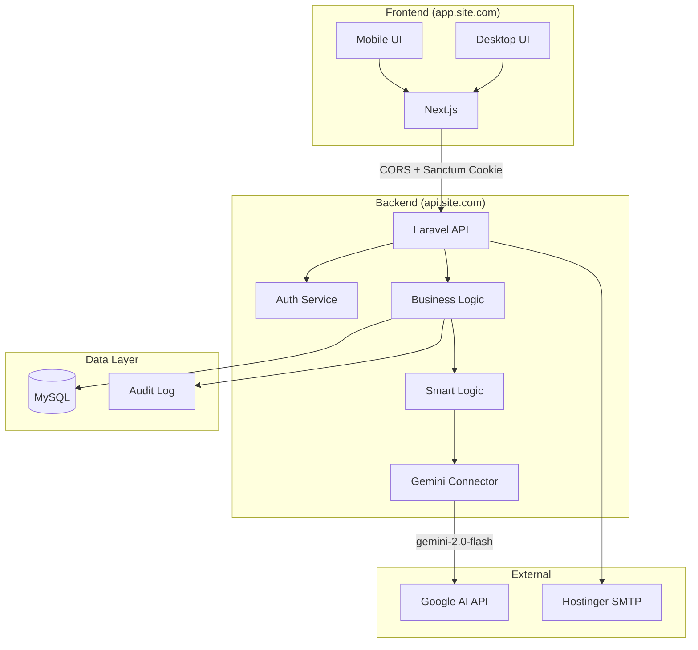

# Integrated Sales, Collections, Shipments & Expenses Management System

Integrated Sales, Collections, Shipments & Expenses Management System

---

## Technology Stack

| Layer | Technology | Details |
|-------|------------|---------|
| **Frontend** | Next.js 14 | App Router, SSR |
| **Styling** | Tailwind CSS + shadcn/ui | RTL support |
| **Backend** | Laravel 12 | RESTful API |
| **Database** | MySQL (Laragon local → Hostinger prod) | inventory_system |
| **Auth** | Laravel Sanctum + Google OAuth | SPA authentication |
| **AI** | Gemini 2.0 Flash | gemini-2.0-flash model |
| **Email** | Hostinger SMTP | Notifications |
| **PDF** | Laravel DomPDF | Reports |
| **Excel** | Laravel Excel | Exports |

---

## Architecture Overview



---

## Environment Setup

### Local Development (Laragon)
```bash
# Database
DB_CONNECTION=mysql
DB_HOST=127.0.0.1
DB_PORT=3306
DB_DATABASE=inventory_system
DB_USERNAME=root
DB_PASSWORD=

# Sanctum (local)
SANCTUM_STATEFUL_DOMAINS=localhost:3000
SESSION_DOMAIN=localhost
```

### Production (Hostinger)
```bash
# Database
DB_CONNECTION=mysql
DB_HOST=<hostinger-mysql-host>
DB_DATABASE=inventory_system
DB_USERNAME=<hostinger-user>
DB_PASSWORD=<hostinger-password>

# Sanctum (production)
SANCTUM_STATEFUL_DOMAINS=app.yoursite.com
SESSION_DOMAIN=.yoursite.com

# Email
MAIL_MAILER=smtp
MAIL_HOST=smtp.hostinger.com
MAIL_PORT=465
MAIL_USERNAME=<email>
MAIL_ENCRYPTION=ssl

# AI
GEMINI_API_KEY=<your-key>
GEMINI_MODEL=gemini-2.0-flash
```

---

## CORS & Sanctum Configuration

### Laravel Configuration

#### config/cors.php
```php
return [
    'paths' => ['api/*', 'sanctum/csrf-cookie'],
    'allowed_origins' => [
        env('FRONTEND_URL', 'http://localhost:3000'),
    ],
    'allowed_methods' => ['*'],
    'allowed_headers' => ['*'],
    'supports_credentials' => true,
];
```

#### config/sanctum.php
```php
return [
    'stateful' => explode(',', env('SANCTUM_STATEFUL_DOMAINS', 
        'localhost,localhost:3000,127.0.0.1'
    )),
];
```

### Next.js Fetch Configuration
```typescript
// lib/api.ts
const api = {
  baseURL: process.env.NEXT_PUBLIC_API_URL,
  
  async fetch(endpoint: string, options: RequestInit = {}) {
    return fetch(`${this.baseURL}${endpoint}`, {
      ...options,
      credentials: 'include',
      headers: {
        'Content-Type': 'application/json',
        'Accept': 'application/json',
        ...options.headers,
      },
    });
  },
  
  async csrf() {
    await this.fetch('/sanctum/csrf-cookie');
  }
};
```

---

## AI Architecture (Two-Layer)

### Smart Logic (Internal - Zero API Cost)
| Feature | Logic |
|---------|-------|
| Price Anomaly | `abs(price - avg_last_10) > avg * 0.30` |
| Shipment Delay | `days_open > expected_days` |
| FIFO Error | `sold_quantity > remaining_quantity` |
| Daily Alert | Unusual patterns in today's data |

### Gemini Connector (External API)
| Feature | When Used |
|---------|-----------|
| Customer Behavior Analysis | On-demand report |
| Shipment Performance Prediction | Settlement time |
| Sales Trend Analysis | Weekly summary |
| Natural Language Insights | Dashboard cards |

---

## MVP Scope

### Phase 1: Core (MVP)
| Module | Features |
|--------|----------|
| **Auth** | Google OAuth, account lockout, basic permissions |
| **Shipments** | CRUD, items with FIFO fields, auto-close |
| **Sales** | Invoices, FIFO allocation, price alerts |
| **Collections** | Cash/bank, invoice linking, auto-distribution |
| **Reports** | Daily report, shipment settlement |

### Phase 2: Extended
- Expenses (supplier/company)
- Cashbox & Bank
- Advanced AI analytics
- Full 46 permissions
- PDF/Excel/Telegram export

---

## Project Structure

```
d:\System\
├── backend/                     # Laravel 11
│   ├── app/
│   │   ├── Http/Controllers/Api/
│   │   ├── Models/
│   │   └── Services/
│   │       ├── SmartLogic/
│   │       └── GeminiConnector/
│   ├── database/migrations/
│   └── routes/api.php
│
└── frontend/                    # Next.js 14
    ├── src/
    │   ├── app/
    │   ├── components/
    │   └── lib/
    └── tailwind.config.ts
```

---

## API Endpoints (MVP)

| Method | Endpoint | Description |
|--------|----------|-------------|
| `GET` | `/sanctum/csrf-cookie` | CSRF token |
| `POST` | `/api/auth/google` | Google OAuth |
| `POST` | `/api/auth/logout` | Logout |
| `GET` | `/api/user` | Current user |
| `GET/POST` | `/api/shipments` | List/Create shipments |
| `GET/PUT` | `/api/shipments/{id}` | Shipment CRUD |
| `GET/POST` | `/api/sales` | List/Create invoices |
| `GET/PUT` | `/api/sales/{id}` | Invoice details/edit (❌ no DELETE) |
| `POST` | `/api/sales/{id}/cancel` | Cancel invoice |
| `GET/POST` | `/api/collections` | List/Create payments |
| `GET` | `/api/reports/daily` | Daily report |
| `GET` | `/api/reports/shipment/{id}` | Settlement report |
```
