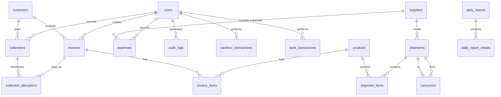

# Database Schema - Sales and Shipments Management System

Complete MySQL Database Schema for Inventory Management System

---

## Entity Relationship Diagram



---

## Tables Overview

| Table | Name | Purpose |
|-------|-------------|---------|
| `users` | Users | System users with permissions |
| `customers` | Customers | Customer accounts & balances |
| `suppliers` | Suppliers | Supplier accounts & balances |
| `products` | Products | 9 fixed product types |
| `shipments` | Shipments | Supplier shipments |
| `shipment_items` | Shipment Items | Items per shipment with FIFO tracking |
| `carryovers` | Carryovers | Transfers between shipments |
| `invoices` | Invoices | Sales invoices |
| `invoice_items` | Invoice Items | Invoice line items |
| `returns` | Returns | Customer returns ← New |
| `return_items` | Return Items | Return line items ← New |
| `collections` | Collections | Customer payments |
| `collection_allocations` | Allocation | Payment distribution to invoices |
| `expenses` | Expenses | Company & supplier expenses |
| `cashbox_transactions` | Cashbox Trans | Cash transactions |
| `bank_transactions` | Bank Trans | Bank transactions |
| `transfers` | Transfers | Cashbox ↔ Bank transfers |
| `daily_reports` | Daily Reports | Daily closing reports |
| `settings` | Settings | System settings |
| `audit_logs` | Audit Logs | All operations log |
| `ai_alerts` | AI Alerts | AI-generated alerts |

---

## 1. Users Table

```sql
CREATE TABLE users (
    id BIGINT UNSIGNED AUTO_INCREMENT PRIMARY KEY,
    name VARCHAR(255) NOT NULL,
    email VARCHAR(255) NOT NULL UNIQUE,
    password VARCHAR(255) NULL, -- For users without Google OAuth
    google_id VARCHAR(255) NULL UNIQUE,
    avatar VARCHAR(255) NULL,
    
    -- Permissions (JSON array of permission codes)
    permissions JSON NOT NULL DEFAULT '[]',
    is_admin BOOLEAN DEFAULT FALSE,
    
    -- Security
    failed_login_attempts TINYINT UNSIGNED DEFAULT 0,
    is_locked BOOLEAN DEFAULT FALSE,
    locked_at TIMESTAMP NULL,
    locked_by BIGINT UNSIGNED NULL,
    remember_token VARCHAR(100) NULL,
    
    -- Timestamps
    email_verified_at TIMESTAMP NULL,
    created_at TIMESTAMP DEFAULT CURRENT_TIMESTAMP,
    updated_at TIMESTAMP DEFAULT CURRENT_TIMESTAMP ON UPDATE CURRENT_TIMESTAMP,
    
    FOREIGN KEY (locked_by) REFERENCES users(id) ON DELETE SET NULL
) ENGINE=InnoDB DEFAULT CHARSET=utf8mb4 COLLATE=utf8mb4_unicode_ci;
```

### Permissions List (51 Total) <!-- Updated 2025-12-16: +4 suppliers +1 corrections -->
```sql
-- Permission codes stored in JSON array
-- Example: ["invoices.create", "invoices.edit", "collections.create"]

-- Invoices - 5 permissions
'invoices.view', 'invoices.create', 'invoices.edit', 'invoices.delete', -- ⚠️ delete disabled (Observer prevents deletion)
'invoices.cancel' -- ✅ alternative to delete

-- Collections - 5 permissions
'collections.view', 'collections.create', 'collections.edit', 'collections.delete', -- ⚠️ delete disabled (Observer prevents deletion)
'collections.cancel' -- ✅ alternative to delete

-- Expenses - 4 permissions
'expenses.view', 'expenses.create', 'expenses.edit', 'expenses.delete'

-- Shipments - 5 permissions
'shipments.view', 'shipments.create', 'shipments.edit', 'shipments.delete', 'shipments.close'

-- Inventory - 3 permissions
'inventory.view', 'inventory.adjust', 'inventory.wastage'

-- Cashbox - 4 permissions
'cashbox.view', 'cashbox.deposit', 'cashbox.withdraw', 'cashbox.transfer'

-- Bank - 4 permissions
'bank.view', 'bank.deposit', 'bank.withdraw', 'bank.transfer'

-- Customers - 4 permissions
'customers.view', 'customers.create', 'customers.edit', 'customers.delete'

-- Suppliers - 4 permissions ✅ NEW
'suppliers.view', 'suppliers.create', 'suppliers.edit', 'suppliers.delete'

-- Reports - 8 permissions
'reports.daily', 'reports.settlement', 'reports.customers', 'reports.suppliers',
'reports.inventory', 'reports.export_pdf', 'reports.export_excel', 'reports.share'

-- Daily Close - 2 permissions
'daily.close', 'daily.reopen'

-- Users - 5 permissions
'users.view', 'users.create', 'users.edit', 'users.delete', 'users.unlock'

-- Settings - 2 permissions
'settings.view', 'settings.edit'

-- Corrections - 1 permission ✅ NEW
'corrections.approve' -- For Maker-Checker workflow
```

---

## 2. Customers Table

> **Balance Logic (Golden Rule):**
> - `+` Positive = Customer **Owes** money (Debtor) - Normal state
> - `0` Zero = Settled
> - `-` Negative = Customer has **Credit** (Paid extra)

```sql
CREATE TABLE customers (
    id BIGINT UNSIGNED AUTO_INCREMENT PRIMARY KEY,
    code VARCHAR(50) NOT NULL UNIQUE,
    name VARCHAR(255) NOT NULL,
    phone VARCHAR(20) NULL,
    address TEXT NULL,
    
    -- Balance: (+) Debtor | (0) Settled | (-) Credit
    balance DECIMAL(15,2) DEFAULT 0.00,
    
    -- Status
    is_active BOOLEAN DEFAULT TRUE,
    notes TEXT NULL,
    
    -- Timestamps
    created_at TIMESTAMP DEFAULT CURRENT_TIMESTAMP,
    updated_at TIMESTAMP DEFAULT CURRENT_TIMESTAMP ON UPDATE CURRENT_TIMESTAMP,
    
    INDEX idx_code (code),
    INDEX idx_name (name),
    INDEX idx_balance (balance)
) ENGINE=InnoDB DEFAULT CHARSET=utf8mb4 COLLATE=utf8mb4_unicode_ci;
```

---

## 3. Suppliers Table

> **Balance Logic:**
> - `+` Positive = Supplier is owed money (We owe them)
> - `0` Zero = Settled
> - `-` Negative = Supplier owes us (We paid extra)

```sql
CREATE TABLE suppliers (
    id BIGINT UNSIGNED AUTO_INCREMENT PRIMARY KEY,
    code VARCHAR(50) NOT NULL UNIQUE,
    name VARCHAR(255) NOT NULL,
    phone VARCHAR(20) NULL,
    address TEXT NULL,
    
    -- Balance: (+) We owe | (0) Settled | (-) They owe
    balance DECIMAL(15,2) DEFAULT 0.00,
    
    -- Status
    is_active BOOLEAN DEFAULT TRUE,
    notes TEXT NULL,
    
    -- Timestamps
    created_at TIMESTAMP DEFAULT CURRENT_TIMESTAMP,
    updated_at TIMESTAMP DEFAULT CURRENT_TIMESTAMP ON UPDATE CURRENT_TIMESTAMP,
    
    INDEX idx_balance (balance)
) ENGINE=InnoDB DEFAULT CHARSET=utf8mb4 COLLATE=utf8mb4_unicode_ci;
```

---

## 4. Products Table

> **⚠️ Note:** Actual Schema uses `name` instead of `code` + `name_ar`
> This is the implemented Schema in Production migrations.

```sql
CREATE TABLE products (
    id BIGINT UNSIGNED AUTO_INCREMENT PRIMARY KEY,
    name VARCHAR(255) NOT NULL UNIQUE,
    name_en VARCHAR(255) NULL,
    category VARCHAR(100) NULL,
    description TEXT NULL,
    
    -- Status
    is_active BOOLEAN DEFAULT TRUE,
    
    -- Timestamps
    created_at TIMESTAMP DEFAULT CURRENT_TIMESTAMP,
    updated_at TIMESTAMP DEFAULT CURRENT_TIMESTAMP ON UPDATE CURRENT_TIMESTAMP
) ENGINE=InnoDB DEFAULT CHARSET=utf8mb4 COLLATE=utf8mb4_unicode_ci;

-- Seed products (example)
INSERT INTO products (name, name_en, category) VALUES
('Product 1', 'Product 1', 'category_a'),
('Product 2', 'Product 2', 'category_b'),
('Product 3', 'Product 3', 'category_c');
```

---

## 5. Shipments Table

```sql
CREATE TABLE shipments (
    id BIGINT UNSIGNED AUTO_INCREMENT PRIMARY KEY,
    number VARCHAR(50) NOT NULL UNIQUE,
    supplier_id BIGINT UNSIGNED NOT NULL,
    
    -- Shipment details
    date DATE NOT NULL,
    driver_name VARCHAR(255) NULL,
    vehicle_number VARCHAR(50) NULL,
    
    -- Status
    status ENUM('open', 'closed', 'settled') DEFAULT 'open',
    closed_at TIMESTAMP NULL,
    settled_at TIMESTAMP NULL,
    
    -- Settlement totals (calculated on close)
    total_sales DECIMAL(15,2) DEFAULT 0.00,
    total_returns DECIMAL(15,2) DEFAULT 0.00,
    total_wastage DECIMAL(15,2) DEFAULT 0.00,
    total_carryover_out DECIMAL(15,2) DEFAULT 0.00,
    total_supplier_expenses DECIMAL(15,2) DEFAULT 0.00,
    final_balance DECIMAL(15,2) DEFAULT 0.00,
    
    -- Metadata
    notes TEXT NULL,
    created_by BIGINT UNSIGNED NOT NULL,
    
    -- Timestamps
    created_at TIMESTAMP DEFAULT CURRENT_TIMESTAMP,
    updated_at TIMESTAMP DEFAULT CURRENT_TIMESTAMP ON UPDATE CURRENT_TIMESTAMP,
    
    FOREIGN KEY (supplier_id) REFERENCES suppliers(id),
    FOREIGN KEY (created_by) REFERENCES users(id),
    INDEX idx_number (number),
    INDEX idx_date (date),
    INDEX idx_status (status)
) ENGINE=InnoDB DEFAULT CHARSET=utf8mb4 COLLATE=utf8mb4_unicode_ci;
```

---

## 6. Shipment Items Table - FIFO Core

```sql
CREATE TABLE shipment_items (
    id BIGINT UNSIGNED AUTO_INCREMENT PRIMARY KEY,
    shipment_id BIGINT UNSIGNED NOT NULL,
    product_id BIGINT UNSIGNED NOT NULL,
    
    -- Weight can vary per shipment (e.g., A10, A9)
    weight_label VARCHAR(50) NULL COMMENT 'Example: A10, A9',
    weight_per_unit DECIMAL(10,3) NOT NULL COMMENT 'Unit weight in KG',
    
    -- Quantities
    cartons INT UNSIGNED NOT NULL COMMENT 'Carton count',
    initial_quantity DECIMAL(15,3) NOT NULL COMMENT 'Initial Quantity in KG',
    remaining_quantity DECIMAL(15,3) NOT NULL COMMENT 'Remaining for FIFO',
    
    -- Tracking
    sold_quantity DECIMAL(15,3) DEFAULT 0.000 COMMENT 'Sold',
    wastage_quantity DECIMAL(15,3) DEFAULT 0.000 COMMENT 'Wastage',
    returned_quantity DECIMAL(15,3) DEFAULT 0.000 COMMENT 'Returned',
    carryover_in_quantity DECIMAL(15,3) DEFAULT 0.000 COMMENT 'Carried In',
    carryover_out_quantity DECIMAL(15,3) DEFAULT 0.000 COMMENT 'Carried Out',
    
    -- Timestamps
    created_at TIMESTAMP DEFAULT CURRENT_TIMESTAMP,
    updated_at TIMESTAMP DEFAULT CURRENT_TIMESTAMP ON UPDATE CURRENT_TIMESTAMP,
    
    FOREIGN KEY (shipment_id) REFERENCES shipments(id) ON DELETE CASCADE,
    FOREIGN KEY (product_id) REFERENCES products(id),
    INDEX idx_remaining (remaining_quantity),
    INDEX idx_product_remaining (product_id, remaining_quantity)
) ENGINE=InnoDB DEFAULT CHARSET=utf8mb4 COLLATE=utf8mb4_unicode_ci;
```

---

## 7. Carryovers Table

```sql
CREATE TABLE carryovers (
    id BIGINT UNSIGNED AUTO_INCREMENT PRIMARY KEY,
    
    -- From shipment
    from_shipment_id BIGINT UNSIGNED NOT NULL,
    from_shipment_item_id BIGINT UNSIGNED NOT NULL,
    
    -- To shipment
    to_shipment_id BIGINT UNSIGNED NOT NULL,
    to_shipment_item_id BIGINT UNSIGNED NULL COMMENT 'created item in new shipment',
    
    product_id BIGINT UNSIGNED NOT NULL,
    
    -- Quantity transferred
    quantity DECIMAL(15,3) NOT NULL,
    cartons INT UNSIGNED NOT NULL,
    weight_per_unit DECIMAL(10,3) NOT NULL,
    
    -- Reason
    reason ENUM('end_of_shipment', 'late_return') DEFAULT 'end_of_shipment',
    notes TEXT NULL,
    
    -- Metadata
    created_by BIGINT UNSIGNED NOT NULL,
    created_at TIMESTAMP DEFAULT CURRENT_TIMESTAMP,
    
    FOREIGN KEY (from_shipment_id) REFERENCES shipments(id),
    FOREIGN KEY (from_shipment_item_id) REFERENCES shipment_items(id),
    FOREIGN KEY (to_shipment_id) REFERENCES shipments(id),
    FOREIGN KEY (to_shipment_item_id) REFERENCES shipment_items(id),
    FOREIGN KEY (product_id) REFERENCES products(id),
    FOREIGN KEY (created_by) REFERENCES users(id)
) ENGINE=InnoDB DEFAULT CHARSET=utf8mb4 COLLATE=utf8mb4_unicode_ci;
```

---

## 8. Invoices Table

> **Important Note:**
> - No `draft` - Drafts are saved in LocalStorage on Frontend
> - `balance` is a standard indexed column (not Generated) - updated via Observers

```sql
CREATE TABLE invoices (
    id BIGINT UNSIGNED AUTO_INCREMENT PRIMARY KEY,
    invoice_number VARCHAR(50) NOT NULL UNIQUE,
    customer_id BIGINT UNSIGNED NOT NULL,
    
    -- Invoice date (for edit window: today + yesterday only)
    date DATE NOT NULL,
    
    -- Financial columns (15,2 = 15 digits, 2 decimal)
    subtotal DECIMAL(15,2) NOT NULL DEFAULT 0.00,
    discount DECIMAL(15,2) DEFAULT 0.00,
    total DECIMAL(15,2) NOT NULL DEFAULT 0.00,
    
    -- Payment tracking (updated via Observers)
    paid_amount DECIMAL(15,2) DEFAULT 0.00,
    balance DECIMAL(15,2) DEFAULT 0.00, -- 👑 Standard indexed column
    
    -- Type
    type ENUM('sale', 'wastage') DEFAULT 'sale' COMMENT 'wastage = zero value wastage',
    
    -- Status: NO DRAFT! (drafts handled in Frontend LocalStorage)
    status ENUM('active', 'cancelled') DEFAULT 'active',
    
    -- Metadata
    notes TEXT NULL,
    created_by BIGINT UNSIGNED NOT NULL,
    
    -- Timestamps
    created_at TIMESTAMP DEFAULT CURRENT_TIMESTAMP,
    updated_at TIMESTAMP DEFAULT CURRENT_TIMESTAMP ON UPDATE CURRENT_TIMESTAMP,
    
    FOREIGN KEY (customer_id) REFERENCES customers(id),
    FOREIGN KEY (created_by) REFERENCES users(id),
    INDEX idx_number (invoice_number),
    INDEX idx_date (date),
    INDEX idx_customer (customer_id),
    INDEX idx_balance (balance), -- 🚀 Fast unpaid invoices query
    INDEX idx_status (status)
) ENGINE=InnoDB DEFAULT CHARSET=utf8mb4 COLLATE=utf8mb4_unicode_ci;
```

---

## 9. Invoice Items Table

```sql
CREATE TABLE invoice_items (
    id BIGINT UNSIGNED AUTO_INCREMENT PRIMARY KEY,
    invoice_id BIGINT UNSIGNED NOT NULL,
    product_id BIGINT UNSIGNED NOT NULL,
    
    -- FIFO Source tracking
    shipment_item_id BIGINT UNSIGNED NOT NULL COMMENT 'FIFO Source',
    shipment_id BIGINT UNSIGNED NOT NULL COMMENT 'For fast reporting',
    
    -- Quantities
    cartons INT UNSIGNED NOT NULL,
    quantity DECIMAL(15,3) NOT NULL COMMENT 'Total Weight in KG',
    
    -- Pricing
    price_per_kg DECIMAL(10,2) NOT NULL COMMENT 'Manual Price per KG',
    total DECIMAL(15,2) NOT NULL,
    
    -- For wastage (type=wastage in invoice)
    is_wastage BOOLEAN DEFAULT FALSE,
    
    -- Timestamps
    created_at TIMESTAMP DEFAULT CURRENT_TIMESTAMP,
    
    FOREIGN KEY (invoice_id) REFERENCES invoices(id) ON DELETE CASCADE,
    FOREIGN KEY (product_id) REFERENCES products(id),
    FOREIGN KEY (shipment_item_id) REFERENCES shipment_items(id),
    FOREIGN KEY (shipment_id) REFERENCES shipments(id),
    INDEX idx_shipment (shipment_id),
    INDEX idx_product (product_id)
) ENGINE=InnoDB DEFAULT CHARSET=utf8mb4 COLLATE=utf8mb4_unicode_ci;
```

---

## 10. Collections Table

```sql
CREATE TABLE collections (
    id BIGINT UNSIGNED AUTO_INCREMENT PRIMARY KEY,
    receipt_number VARCHAR(50) NOT NULL UNIQUE,
    customer_id BIGINT UNSIGNED NOT NULL,
    
    -- Date (for edit window: today + yesterday only)
    date DATE NOT NULL,
    
    -- Amount
    amount DECIMAL(15,2) NOT NULL,
    
    -- Payment method
    payment_method ENUM('cash', 'bank') NOT NULL,
    
    -- Distribution method
    distribution_method ENUM('oldest_first', 'newest_first', 'manual') DEFAULT 'oldest_first',
    
    -- If linked to specific invoice
    invoice_id BIGINT UNSIGNED NULL COMMENT 'if manual linking',
    
    -- Status (⚠️ correction 2025-12-13: added cancelled)
    status ENUM('confirmed', 'cancelled') DEFAULT 'confirmed',
    
    -- Metadata
    notes TEXT NULL,
    created_by BIGINT UNSIGNED NOT NULL,
    
    -- Timestamps
    created_at TIMESTAMP DEFAULT CURRENT_TIMESTAMP,
    updated_at TIMESTAMP DEFAULT CURRENT_TIMESTAMP ON UPDATE CURRENT_TIMESTAMP,
    
    FOREIGN KEY (customer_id) REFERENCES customers(id),
    FOREIGN KEY (invoice_id) REFERENCES invoices(id) ON DELETE SET NULL,
    FOREIGN KEY (created_by) REFERENCES users(id),
    INDEX idx_date (date),
    INDEX idx_customer (customer_id),
    INDEX idx_method (payment_method)
) ENGINE=InnoDB DEFAULT CHARSET=utf8mb4 COLLATE=utf8mb4_unicode_ci;
```

---

## 11. Collection Allocations Table

```sql
CREATE TABLE collection_allocations (
    id BIGINT UNSIGNED AUTO_INCREMENT PRIMARY KEY,
    collection_id BIGINT UNSIGNED NOT NULL,
    invoice_id BIGINT UNSIGNED NOT NULL,
    
    -- Amount allocated to this invoice
    amount DECIMAL(15,2) NOT NULL,
    
    -- Timestamps
    created_at TIMESTAMP DEFAULT CURRENT_TIMESTAMP,
    
    FOREIGN KEY (collection_id) REFERENCES collections(id) ON DELETE CASCADE,
    FOREIGN KEY (invoice_id) REFERENCES invoices(id),
    INDEX idx_invoice (invoice_id)
) ENGINE=InnoDB DEFAULT CHARSET=utf8mb4 COLLATE=utf8mb4_unicode_ci;
```

---

## 12. Expenses Table

```sql
CREATE TABLE expenses (
    id BIGINT UNSIGNED AUTO_INCREMENT PRIMARY KEY,
    
    -- Type: supplier=Supplier Expense, company=Company Expense, supplier_payment=Payment to Supplier
    type ENUM('supplier', 'company', 'supplier_payment') NOT NULL,
    
    -- For supplier expenses, link to shipment for settlement
    supplier_id BIGINT UNSIGNED NULL,
    shipment_id BIGINT UNSIGNED NULL COMMENT 'To show in shipment settlement',
    
    -- Details
    date DATE NOT NULL,
    amount DECIMAL(15,2) NOT NULL,
    description VARCHAR(500) NOT NULL,
    
    -- Payment method
    payment_method ENUM('cash', 'bank') NOT NULL,
    
    -- Category (optional)
    category VARCHAR(100) NULL,
    
    -- Metadata
    notes TEXT NULL,
    created_by BIGINT UNSIGNED NOT NULL,
    
    -- Timestamps
    created_at TIMESTAMP DEFAULT CURRENT_TIMESTAMP,
    updated_at TIMESTAMP DEFAULT CURRENT_TIMESTAMP ON UPDATE CURRENT_TIMESTAMP,
    
    FOREIGN KEY (supplier_id) REFERENCES suppliers(id) ON DELETE SET NULL,
    FOREIGN KEY (shipment_id) REFERENCES shipments(id) ON DELETE SET NULL,
    FOREIGN KEY (created_by) REFERENCES users(id),
    INDEX idx_date (date),
    INDEX idx_type (type),
    INDEX idx_shipment (shipment_id)
) ENGINE=InnoDB DEFAULT CHARSET=utf8mb4 COLLATE=utf8mb4_unicode_ci;
```

---

## 13. Cashbox Transactions Table

```sql
CREATE TABLE cashbox_transactions (
    id BIGINT UNSIGNED AUTO_INCREMENT PRIMARY KEY,
    
    -- Transaction type
    type ENUM('collection', 'expense', 'deposit', 'withdrawal', 'transfer_in', 'transfer_out') NOT NULL,
    
    -- Amount (positive for in, negative for out)
    amount DECIMAL(15,2) NOT NULL,
    
    -- Running balance after this transaction
    balance_after DECIMAL(15,2) NOT NULL,
    
    -- Reference to source
    reference_type VARCHAR(50) NULL COMMENT 'collection, expense, transfer',
    reference_id BIGINT UNSIGNED NULL,
    
    -- Details
    date DATE NOT NULL,
    description VARCHAR(500) NULL,
    
    -- Metadata
    created_by BIGINT UNSIGNED NOT NULL,
    created_at TIMESTAMP DEFAULT CURRENT_TIMESTAMP,
    
    FOREIGN KEY (created_by) REFERENCES users(id),
    INDEX idx_date (date),
    INDEX idx_type (type)
) ENGINE=InnoDB DEFAULT CHARSET=utf8mb4 COLLATE=utf8mb4_unicode_ci;
```

---

## 14. Bank Transactions Table

```sql
CREATE TABLE bank_transactions (
    id BIGINT UNSIGNED AUTO_INCREMENT PRIMARY KEY,
    
    -- Transaction type
    type ENUM('collection', 'expense', 'deposit', 'withdrawal', 'transfer_in', 'transfer_out') NOT NULL,
    
    -- Amount
    amount DECIMAL(15,2) NOT NULL,
    
    -- Running balance after this transaction
    balance_after DECIMAL(15,2) NOT NULL,
    
    -- Reference to source
    reference_type VARCHAR(50) NULL,
    reference_id BIGINT UNSIGNED NULL,
    
    -- Details
    date DATE NOT NULL,
    description VARCHAR(500) NULL,
    
    -- No pending/rejected status per requirements
    
    -- Metadata
    created_by BIGINT UNSIGNED NOT NULL,
    created_at TIMESTAMP DEFAULT CURRENT_TIMESTAMP,
    
    FOREIGN KEY (created_by) REFERENCES users(id),
    INDEX idx_date (date),
    INDEX idx_type (type)
) ENGINE=InnoDB DEFAULT CHARSET=utf8mb4 COLLATE=utf8mb4_unicode_ci;
```

---

## 15. Transfers Table (Between Cashbox and Bank)

```sql
CREATE TABLE transfers (
    id BIGINT UNSIGNED AUTO_INCREMENT PRIMARY KEY,
    
    -- Direction
    from_account ENUM('cashbox', 'bank') NOT NULL,
    to_account ENUM('cashbox', 'bank') NOT NULL,
    
    amount DECIMAL(15,2) NOT NULL,
    date DATE NOT NULL,
    
    -- Related transactions
    cashbox_transaction_id BIGINT UNSIGNED NULL,
    bank_transaction_id BIGINT UNSIGNED NULL,
    
    -- Metadata
    notes TEXT NULL,
    created_by BIGINT UNSIGNED NOT NULL,
    created_at TIMESTAMP DEFAULT CURRENT_TIMESTAMP,
    
    FOREIGN KEY (cashbox_transaction_id) REFERENCES cashbox_transactions(id),
    FOREIGN KEY (bank_transaction_id) REFERENCES bank_transactions(id),
    FOREIGN KEY (created_by) REFERENCES users(id),
    INDEX idx_date (date)
) ENGINE=InnoDB DEFAULT CHARSET=utf8mb4 COLLATE=utf8mb4_unicode_ci;
```

---

## 15.5 Accounts Table - Best Practice

> 💡 **Why this table?**
> Instead of calculating balance from last transaction every time (slow),
> we keep current balance here and update via Observers (very fast).

```sql
CREATE TABLE accounts (
    id BIGINT UNSIGNED AUTO_INCREMENT PRIMARY KEY,
    
    type ENUM('cashbox', 'bank') NOT NULL UNIQUE,
    name VARCHAR(100) NOT NULL,
    
    -- Current balance (updated via Observers)
    balance DECIMAL(15,2) DEFAULT 0.00,
    
    -- Timestamps
    updated_at TIMESTAMP DEFAULT CURRENT_TIMESTAMP ON UPDATE CURRENT_TIMESTAMP
) ENGINE=InnoDB DEFAULT CHARSET=utf8mb4 COLLATE=utf8mb4_unicode_ci;

-- Seed accounts
INSERT INTO accounts (type, name, balance) VALUES
('cashbox', 'Main Cashbox', 0.00),
('bank', 'Main Bank', 0.00);
```

### AccountObserver - Auto Balance Update

```php
// Called from CashboxTransactionObserver and BankTransactionObserver
class AccountService
{
    public function updateCashboxBalance(float $amount): void
    {
        Account::where('type', 'cashbox')->increment('balance', $amount);
    }
    
    public function updateBankBalance(float $amount): void
    {
        Account::where('type', 'bank')->increment('balance', $amount);
    }
}
```

---

## 16. Daily Reports Table

> **Note:** Implemented Schema uses simplified structure with `daily_report_details`.

```sql
CREATE TABLE daily_reports (
    id BIGINT UNSIGNED AUTO_INCREMENT PRIMARY KEY,
    
    date DATE NOT NULL UNIQUE,
    
    -- Totals (calculated)
    total_sales DECIMAL(15,2) DEFAULT 0.00,
    total_collections DECIMAL(15,2) DEFAULT 0.00,
    total_expenses DECIMAL(15,2) DEFAULT 0.00,
    cash_balance DECIMAL(15,2) DEFAULT 0.00,
    bank_balance DECIMAL(15,2) DEFAULT 0.00,
    
    -- Counts
    invoices_count INT DEFAULT 0,
    collections_count INT DEFAULT 0,
    expenses_count INT DEFAULT 0,
    
    -- Metadata
    notes TEXT NULL,
    created_by BIGINT UNSIGNED NULL,
    
    -- Timestamps
    created_at TIMESTAMP DEFAULT CURRENT_TIMESTAMP,
    updated_at TIMESTAMP DEFAULT CURRENT_TIMESTAMP ON UPDATE CURRENT_TIMESTAMP,
    
    FOREIGN KEY (created_by) REFERENCES users(id) ON DELETE SET NULL
) ENGINE=InnoDB DEFAULT CHARSET=utf8mb4 COLLATE=utf8mb4_unicode_ci;

-- Daily Report Details
CREATE TABLE daily_report_details (
    id BIGINT UNSIGNED AUTO_INCREMENT PRIMARY KEY,
    
    daily_report_id BIGINT UNSIGNED NOT NULL,
    type ENUM('sale', 'collection', 'expense') NOT NULL,
    reference_id BIGINT UNSIGNED NOT NULL,
    reference_type VARCHAR(255) NOT NULL,
    amount DECIMAL(15,2) NOT NULL,
    
    created_at TIMESTAMP DEFAULT CURRENT_TIMESTAMP,
    updated_at TIMESTAMP DEFAULT CURRENT_TIMESTAMP ON UPDATE CURRENT_TIMESTAMP,
    
    FOREIGN KEY (daily_report_id) REFERENCES daily_reports(id) ON DELETE CASCADE,
    INDEX idx_reference (reference_type, reference_id)
) ENGINE=InnoDB DEFAULT CHARSET=utf8mb4 COLLATE=utf8mb4_unicode_ci;
```

---

## 17. Settings Table

```sql
CREATE TABLE settings (
    id BIGINT UNSIGNED AUTO_INCREMENT PRIMARY KEY,
    
    `key` VARCHAR(100) NOT NULL UNIQUE,
    `value` TEXT NULL,
    `type` ENUM('string', 'number', 'boolean', 'json') DEFAULT 'string',
    
    description VARCHAR(255) NULL,
    
    updated_at TIMESTAMP DEFAULT CURRENT_TIMESTAMP ON UPDATE CURRENT_TIMESTAMP
) ENGINE=InnoDB DEFAULT CHARSET=utf8mb4 COLLATE=utf8mb4_unicode_ci;

-- Default settings
INSERT INTO settings (`key`, `value`, `type`, description) VALUES
('weight_entry_mode', 'total_weight', 'string', 'Weight Entry Mode: total_weight or unit_weight'),
('collection_distribution', 'oldest_first', 'string', 'Collection Distribution: oldest_first or newest_first'),
('price_anomaly_threshold', '30', 'number', 'Price Anomaly Threshold %'),
('shipment_delay_days', '7', 'number', 'Shipment Delay Alert Days'),
('edit_window_days', '1', 'number', 'Edit Window: Today + X Days'),
('company_name', 'Company Name', 'string', 'Company Name'),
('company_phone', '', 'string', 'Company Phone'),
('company_address', '', 'string', 'Company Address'),
-- Invoice Number Settings
('invoice_number_prefix', 'INV', 'string', 'Invoice Prefix'),
('invoice_number_format', '{prefix}-{year}{month}-{sequence}', 'string', 'Invoice Format'),
('invoice_number_sequence_length', '4', 'number', 'Sequence Length'),
('invoice_number_reset_monthly', 'true', 'boolean', 'Reset Monthly'),
-- Receipt Number Settings
('receipt_number_prefix', 'REC', 'string', 'Receipt Prefix'),
-- Shipment Number Settings
('shipment_number_prefix', 'SHP', 'string', 'Shipment Prefix'),
-- Report Settings
('company_commission_rate', '6', 'number', 'Company Commission Rate %'),
('backdated_days', '2', 'number', 'Backdated Entry Days');
```

---

## 18. Audit Logs Table

```sql
CREATE TABLE audit_logs (
    id BIGINT UNSIGNED AUTO_INCREMENT PRIMARY KEY,
    
    user_id BIGINT UNSIGNED NULL,
    
    -- Action details
    action ENUM('create', 'update', 'delete', 'login', 'logout', 'close', 'carryover', 'export') NOT NULL,
    model_type VARCHAR(100) NOT NULL COMMENT 'e.g., Invoice, Collection, Shipment',
    model_id BIGINT UNSIGNED NULL,
    
    -- Changes
    old_values JSON NULL,
    new_values JSON NULL,
    
    -- Context
    ip_address VARCHAR(45) NULL,
    user_agent VARCHAR(500) NULL,
    
    -- Timestamp
    created_at TIMESTAMP DEFAULT CURRENT_TIMESTAMP,
    
    FOREIGN KEY (user_id) REFERENCES users(id) ON DELETE SET NULL,
    INDEX idx_user (user_id),
    INDEX idx_model (model_type, model_id),
    INDEX idx_action (action),
    INDEX idx_created (created_at)
) ENGINE=InnoDB DEFAULT CHARSET=utf8mb4 COLLATE=utf8mb4_unicode_ci;
```

---

## 19. AI Alerts Table

```sql
CREATE TABLE ai_alerts (
    id BIGINT UNSIGNED AUTO_INCREMENT PRIMARY KEY,
    
    -- Alert type
    type ENUM(
        'price_anomaly',
        'shipment_delay',
        'carryover_error',
        'performance_analysis',
        'customer_behavior',
        'settlement_alert',
        'daily_alert'
    ) NOT NULL,
    
    -- Severity
    severity ENUM('info', 'warning', 'critical') DEFAULT 'warning',
    
    -- Related entity
    entity_type VARCHAR(100) NULL COMMENT 'Invoice, Shipment, Customer',
    entity_id BIGINT UNSIGNED NULL,
    
    -- Alert content
    title VARCHAR(255) NOT NULL,
    message TEXT NOT NULL,
    data JSON NULL COMMENT 'Additional context data',
    
    -- Source
    source ENUM('smart_logic', 'gemini') NOT NULL,
    
    -- Status
    is_read BOOLEAN DEFAULT FALSE,
    read_by BIGINT UNSIGNED NULL,
    read_at TIMESTAMP NULL,
    
    -- Timestamps
    created_at TIMESTAMP DEFAULT CURRENT_TIMESTAMP,
    
    FOREIGN KEY (read_by) REFERENCES users(id),
    INDEX idx_type (type),
    INDEX idx_severity (severity),
    INDEX idx_unread (is_read, created_at)
) ENGINE=InnoDB DEFAULT CHARSET=utf8mb4 COLLATE=utf8mb4_unicode_ci;
```

---

## Key Indexes Summary

| Table | Index Purpose |
|-------|---------------|
| `shipment_items` | `(product_id, remaining_quantity)` - FIFO allocation queries |
| `invoices` | `(customer_id, balance)` - Unpaid invoices |
| `collections` | `(customer_id, date)` - Customer payment history |
| `audit_logs` | `(model_type, model_id)` - Entity history |
| `ai_alerts` | `(is_read, created_at)` - Unread alerts |

---

## Laravel Observers (Instead of SQL Triggers)

> **Note:** We use Laravel Observers instead of SQL Triggers to keep logic in PHP code.

### Required Observers

| Observer | Model | Events | Purpose |
|----------|-------|--------|----------|
| `InvoiceObserver` | Invoice | created, updated, deleted | Update customer balance |
| `CollectionObserver` | Collection | created, updated, deleted | Update customer balance + allocate payment |
| `ShipmentItemObserver` | ShipmentItem | updated | Close shipment automatically when stock depleted |
| `ExpenseObserver` | Expense | created, updated, deleted | Update supplier balance for expenses |

### Observer Logic Examples

```php
// app/Observers/InvoiceObserver.php
use Illuminate\Support\Facades\DB;

class InvoiceObserver
{
    /**
     * On Invoice Creation:
     * 1. Set balance = total (since paid_amount = 0)
     * 2. Increase customer balance (Debtor)
     */
    public function created(Invoice $invoice): void
    {
        DB::transaction(function () use ($invoice) {
            // 1. Set invoice balance = total
            $invoice->balance = $invoice->total;
            $invoice->saveQuietly();
            
            // 2. Increase customer balance (customer owes us)
            $invoice->customer->increment('balance', $invoice->total);
        });
    }
    
    /**
     * 🛡️ On Invoice Update - Comprehensive handling:
     * - Status change (active → cancelled)
     * - Total change
     * - Safety checks
     */
    public function updated(Invoice $invoice): void
    {
        DB::transaction(function () use ($invoice) {
            
            // 🔴 Case 1: Cancel Invoice (active → cancelled)
            if ($invoice->wasChanged('status')) {
                $oldStatus = $invoice->getOriginal('status');
                $newStatus = $invoice->status;
                
                if ($oldStatus === 'active' && $newStatus === 'cancelled') {
                    // ⚠️ Step 1: Detach Allocations first
                    // This will return paid amounts as credit to customer
                    $allocations = $invoice->allocations;
                    foreach ($allocations as $allocation) {
                        // Delete allocation - Observer will increase customer.balance by amount
                        $allocation->delete();
                    }
                    
                    // ⚠️ Step 2: Decrease customer balance by Total (not Balance)
                    // Because allocations.delete returned paid_amount as credit
                    $invoice->customer->decrement('balance', $invoice->total);
                    
                    // ⚠️ Step 3: Zero out invoice
                    $invoice->balance = 0;
                    $invoice->paid_amount = 0;
                    $invoice->saveQuietly();
                    
                    return; // No need to check other changes
                }
                
                // ❌ Reactivating cancelled invoice (cancelled → active) - Forbidden
                // Because allocations are deleted and cannot be restored
                if ($oldStatus === 'cancelled' && $newStatus === 'active') {
                    throw new \Exception("Cannot reactivate cancelled invoice. Create a new one.");
                }
            }
            
            // 🔵 Case 2: Invoice Total Change
            if ($invoice->wasChanged('total')) {
                $oldTotal = $invoice->getOriginal('total');
                $newTotal = $invoice->total;
                
                // 🛡️ Safety Check: New Total < Paid Amount?
                if ($newTotal < $invoice->paid_amount) {
                    throw new \Exception(
                        "Cannot reduce invoice total below paid amount ({$invoice->paid_amount})"
                    );
                }
                
                $diff = $newTotal - $oldTotal;
                $invoice->balance = $newTotal - $invoice->paid_amount;
                $invoice->saveQuietly();
                
                if ($diff > 0) {
                    $invoice->customer->increment('balance', $diff);
                } else {
                    $invoice->customer->decrement('balance', abs($diff));
                }
            }
        });
    }
    
    /**
     * 🚫 Prevent Deletion - Use Cancellation instead
     * Cancellation is better for audit trail
     */
    public function deleting(Invoice $invoice): bool
    {
        throw new \Exception(
            "Cannot delete invoices. Use invalidation/cancellation instead to preserve audit trail."
        );
    }
}

// app/Observers/CollectionAllocationObserver.php
// 👑 Most Important Observer - Runs when allocating payment to invoices
class CollectionAllocationObserver
{
    /**
     * When allocating amount to invoice:
     * 1. Increase invoice paid_amount
     * 2. Decrease invoice balance
     */
    public function created(CollectionAllocation $allocation): void
    {
        $invoice = $allocation->invoice;
        
        $invoice->increment('paid_amount', $allocation->amount);
        $invoice->decrement('balance', $allocation->amount);
    }
    
    /**
     * When deleting allocation (reverse operation)
     */
    public function deleted(CollectionAllocation $allocation): void
    {
        $invoice = $allocation->invoice;
        
        $invoice->decrement('paid_amount', $allocation->amount);
        $invoice->increment('balance', $allocation->amount);
    }
}

// app/Observers/CollectionObserver.php
class CollectionObserver
{
    /**
     * On Collection Create:
     * 1. Decrease customer balance
     * 2. Distribute amount to invoices (FIFO)
     */
    public function created(Collection $collection): void
    {
        // 1. Decrease customer balance
        $collection->customer->decrement('balance', $collection->amount);
        
        // 2. FIFO allocation is handled by CollectionService
        // (called before saving, creates CollectionAllocations)
    }
    
    /**
     * On Collection Delete:
     * Increase customer balance
     */
    public function deleted(Collection $collection): void
    {
        $collection->customer->increment('balance', $collection->amount);
        // CollectionAllocations cascade delete will trigger their observers
    }
}

// app/Observers/ShipmentItemObserver.php  
class ShipmentItemObserver
{
    public function updated(ShipmentItem $item): void
    {
        // If depleted, check if shipment should be closed
        if ($item->remaining_quantity == 0 && $item->wasChanged('remaining_quantity')) {
            $totalRemaining = $item->shipment->items()->sum('remaining_quantity');
            
            if ($totalRemaining == 0) {
                $item->shipment->update([
                    'status' => 'closed',
                    'closed_at' => now()
                ]);
            }
        }
    }
}

// app/Observers/ShipmentObserver.php
use Illuminate\Support\Facades\DB;

class ShipmentObserver
{
    /**
     * 🚫 Prevent deleting shipment with linked invoices
     */
    public function deleting(Shipment $shipment): bool
    {
        $hasInvoices = InvoiceItem::whereIn('shipment_item_id', 
            $shipment->items->pluck('id')
        )->exists();
        
        if ($hasInvoices) {
            throw new \Exception("Cannot delete shipment with linked invoices.");
        }
        
        return true;
    }
    
    /**
     * 🛡️ Check before update
     * - Settled shipment: only allow changing status
     */
    public function updating(Shipment $shipment): bool
    {
        if ($shipment->getOriginal('status') === 'settled') {
            // Only allow changing status (for Unsettle)
            $changedFields = array_keys($shipment->getDirty());
            $allowedFields = ['status', 'updated_at'];
            
            $forbiddenChanges = array_diff($changedFields, $allowedFields);
            
            if (!empty($forbiddenChanges)) {
                throw new \Exception(
                    "Cannot edit settled shipment. Forbidden fields: " . implode(', ', $forbiddenChanges)
                );
            }
        }
        
        return true;
    }
    
    /**
     * 🔄 After update - Handle Unsettle
     * When settled → closed/open: Reverse Carryovers
     */
    public function updated(Shipment $shipment): void
    {
        $oldStatus = $shipment->getOriginal('status');
        $newStatus = $shipment->status;
        
        // Scenario: Unsettle
        if ($oldStatus === 'settled' && $newStatus !== 'settled') {
            $this->reverseCarryovers($shipment);
        }
    }
    
    /**
     * 🔙 Reverse Carryovers on Unsettle
     */
    private function reverseCarryovers(Shipment $shipment): void
    {
        DB::transaction(function () use ($shipment) {
            // 1. Get all carryovers from this shipment due to settlement
            $carryovers = Carryover::where('from_shipment_id', $shipment->id)
                ->where('reason', 'end_of_shipment')
                ->with(['fromShipmentItem', 'toShipmentItem', 'toShipment'])
                ->get();
            
            foreach ($carryovers as $carryover) {
                // 🛑 Safety: Has next shipment sold this stock?
                $nextItem = $carryover->toShipmentItem;
                
                if ($nextItem->remaining_quantity < $carryover->quantity) {
                    throw new \Exception(
                        "Cannot Unsettle! " .
                        "Carried over quantity ({$carryover->quantity}) has been sold from shipment " .
                        "number {$carryover->toShipment->number}. " .
                        "Remaining only: {$nextItem->remaining_quantity}"
                    );
                }
                
                // 2. Return quantity to current shipment (old)
                $carryover->fromShipmentItem->increment('remaining_quantity', $carryover->quantity);
                
                // 3. Deduct quantity from next shipment (new)
                $nextItem->decrement('initial_quantity', $carryover->quantity);
                $nextItem->decrement('remaining_quantity', $carryover->quantity);
                
                // 4. If item in next shipment becomes empty, delete it
                if ($nextItem->initial_quantity <= 0) {
                    $nextItem->delete();
                }
                
                // 5. Delete carryover record
                $carryover->delete();
            }
            
            // 6. Reset settled_at to null
            $shipment->settled_at = null;
            $shipment->saveQuietly();
        });
    }
}
```

### FIFO Payment Service

> ⚠️ **Important:** Use `DB::transaction` to ensure atomicity.

```php
// app/Services/CollectionService.php
use Illuminate\Support\Facades\DB;

class CollectionService
{
    /**
     * Allocate Collection amount to invoices (FIFO)
     * Called before saving collection
     * 
     * @throws \Exception Auto-rollback on failure
     */
    public function allocatePayment(Collection $collection): void
    {
        DB::transaction(function () use ($collection) {
            $remaining = $collection->amount;
            
            // 🚀 Rocket Speed Query thanks to Index on balance
            // lockForUpdate() to prevent race conditions
            $unpaidInvoices = Invoice::where('customer_id', $collection->customer_id)
                ->where('balance', '>', 0)
                ->where('status', 'active')
                ->orderBy('date', 'asc') // FIFO: Oldest first
                ->lockForUpdate() // 🔒 Lock rows
                ->get();
            
            foreach ($unpaidInvoices as $invoice) {
                if ($remaining <= 0) break;
                
                $allocateAmount = min($remaining, $invoice->balance);
                
                // Create Allocation (Observer will update invoice)
                CollectionAllocation::create([
                    'collection_id' => $collection->id,
                    'invoice_id' => $invoice->id,
                    'amount' => $allocateAmount,
                ]);
                
                $remaining -= $allocateAmount;
            }
            
            // If amount remains = Credit to Customer (Negative Balance)
        });
    }
    
    /**
     * Reverse Allocations (On Collection Delete)
     */
    public function reverseAllocations(Collection $collection): void
    {
        DB::transaction(function () use ($collection) {
            // Observers will handle invoice updates
            $collection->allocations()->delete();
        });
    }
}
```


### Register Observers

```php
// app/Providers/AppServiceProvider.php
public function boot(): void
{
    Invoice::observe(InvoiceObserver::class);
    Collection::observe(CollectionObserver::class);
    CollectionAllocation::observe(CollectionAllocationObserver::class);
    Shipment::observe(ShipmentObserver::class);
    ShipmentItem::observe(ShipmentItemObserver::class);
    Expense::observe(ExpenseObserver::class);
}
```
