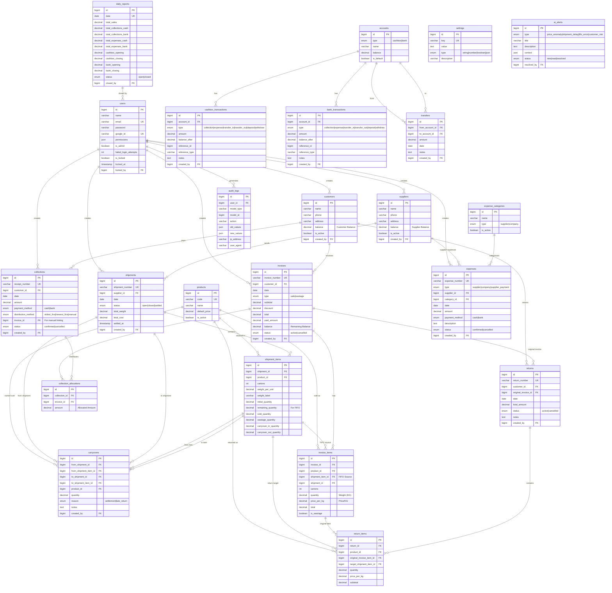

# Entity Relationship Diagram - Sales and Shipments Management System

## 📊 Comprehensive ERD



---

## 📋 Tables Summary

| Category | Tables | Count |
|-------|---------|-------|
| **Users & Auth** | users | 1 |
| **Master Data** | customers, suppliers, products | 3 |
| **Shipments** | shipments, shipment_items, carryovers | 3 |
| **Sales** | invoices, invoice_items | 2 |
| **Returns** | returns, return_items | 2 |
| **Collections** | collections, collection_allocations | 2 |
| **Expenses** | expenses, expense_categories | 2 |
| **Financial** | accounts, cashbox_transactions, bank_transactions, transfers | 4 |
| **System** | daily_reports, settings, audit_logs, ai_alerts | 4 |
| **Total** | | **23** |

---

## 🔗 Key Relationships

### FIFO Flow
```
shipments → shipment_items → invoice_items → invoices
                ↓
            carryovers (settlement/late_return)
```

### Payment Flow
```
customers → invoices → collection_allocations ← collections
                              ↓
                    cashbox_transactions / bank_transactions
```

### Return Flow
```
invoices → invoice_items → return_items → returns
                ↓
         shipment_items (remaining_quantity++)
```

---

## 🎯 Important Notes

1. **Deletion Forbidden** for invoices and collections - use Cancellation
2. **FIFO** ordered by `shipments.date`, not `created_at`
3. **Calculation:** `total = quantity(kg) × price_per_kg`
4. **48 Permissions** distributed across 9 modules
